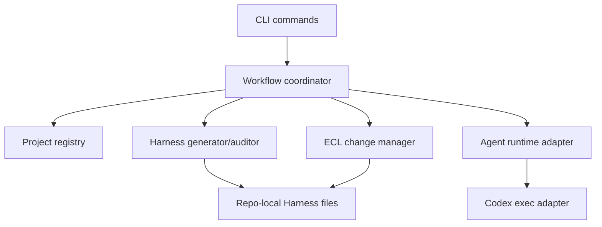

# Architecture

> Status: Phase 1 implements the CLI foundation. Runtime execution and dashboard remain future work.

## 1. Overview

Agent Harness Orchestrator is a single-package TypeScript CLI first. It manages local project registration, repo-local Harness files, ECL changes, validation commands, and later Codex-first coding runs.

## 2. Initial Technical Choices

| Decision | Choice | Reason |
| --- | --- | --- |
| Runtime | Node.js 20+ | Good fit for CLI, file workflows, JSON, and process adapters |
| Language | TypeScript | Strong local domain types without heavy runtime cost |
| Packaging | Single package | Keeps Phase 1 simple |
| Storage | Flat files first | Low install friction, no native SQLite dependency |
| Runtime adapter | Future Codex `exec` | Traceable stdout, stderr, exit code, artifacts |
| UI | CLI first, Web UI later | Stabilize domain model before dashboard |

## 3. Components

## 4. Module Boundaries

| Module | Responsibility |
| --- | --- |
| Project registry | User-level managed project list and status cache |
| Harness generator | Create and update Core Harness files |
| Harness auditor | Detect missing, partial, or inconsistent Harness state |
| ECL change manager | new, park, resume, close, reindex |
| Evolution manager | pending detection and mark-complete workflow |
| Runtime adapter | Codex-first process execution, later interactive sessions |
| Validator | Run project-specific verification commands |

## 5. Reference Project Implications

Agent Orchestrator informs worktree isolation, dashboard state, plugin slots, and flat-file run metadata.

oh-my-codex informs Codex workflow organization, hooks, sessions, and agent role boundaries.

ecl-harness-engineer defines the Harness and ECL lifecycle baseline.

## 6. Phase Boundary

Phase 1 includes project and Harness management only. Worktree management, Codex runtime, interactive terminals, Web UI, and SQLite belong in later structured changes.
