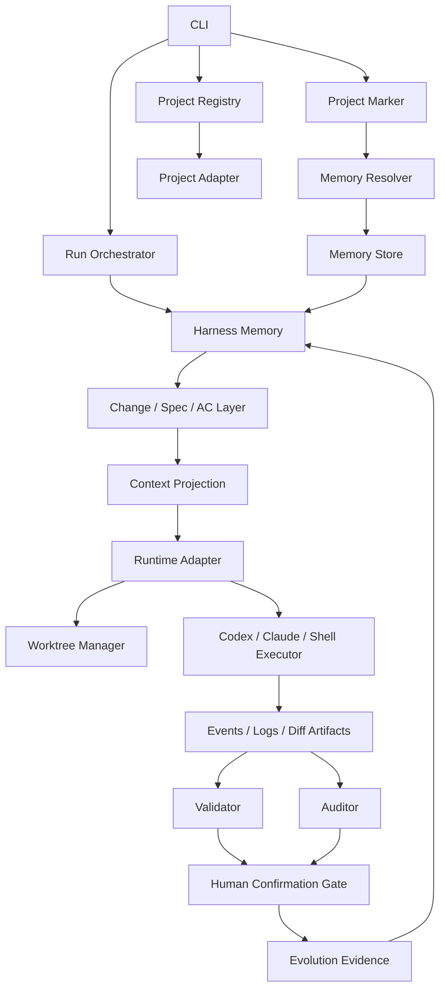

# Architecture

> Status: Phase 3A implements project registration, Harness management, structured change management, local command runs, Codex read-only proposal capture, memory resolver diagnostics, opt-in external-local memory, and AHO-owned worktree execution. Phase 3B adds change-scoped validation. Phase 3C adds Codex-powered read-only Auditor proposal artifacts. Phase 3D adds Codex workspace-write Coder runs inside AHO-owned worktrees. Phase 3E adds explicit apply/discard gates for accepted worktree proposals. Phase 4A adds explicit Spec-Test evidence mapping. Phase 4B adds Codex read-only proposals for reusing existing source-root evidence. Phase 4C adds Codex-assisted passing test generation in AHO-owned worktrees. Merge/PR/push, CI drift gates, dashboard, and remote memory remain planned future work.

## 1. Current Status

Agent Harness Orchestrator is a single-package TypeScript CLI. It currently manages local project registration, Harness audit/init, ECL index rebuilds, structured change creation/status/close, Acceptance Criteria parsing, task mapping, generated `ac-map.json`, explicit `spec-tests.json` evidence mapping, Codex-assisted existing-evidence proposals, Codex-assisted passing test generation proposals, local command run artifacts, Codex read-only proposal artifacts, validation artifacts, Auditor proposal artifacts, Codex Coder proposal artifacts, apply/discard artifacts, diagnostic memory status, opt-in external-local memory, and AHO-owned worktrees.

The long-term architecture is a local-first, Spec-Anchored managed-run harness. AHO keeps durable project memory in AHO-managed stores, prepares context for disposable external agents, records execution evidence, and routes every high-impact result through human confirmation.

## 2. Product Kernel

The product kernel is not "run many agents." The kernel is keeping specs, acceptance criteria, plans, tasks, code changes, validation, review, and Harness evolution synchronized.

Core chain:

```text
User Intent
-> Change Intake
-> Spec Agent proposal
-> Human confirm Spec
-> Planner Agent proposal
-> Human confirm Plan
-> Worktree Run
-> Coder Agent proposal/diff
-> Validator result
-> Auditor Agent proposal
-> Human confirm apply/merge
-> Spec/Status update if needed
-> Human confirm close
-> Archive
-> Evolution evidence
-> Human confirm Harness evolution
```

Domain relationship:

```text
Project -> Change -> Spec / Acceptance Criteria -> Plan -> Tasks
-> Context Projection -> Run -> Events / Artifacts -> Validation / Review
```

## 3. Layered Architecture



## 4. Project Memory Model

Project memory is durable and AHO-managed. Repo-local memory is the current implementation and compatibility mode, not the long-term default.

Memory modes:

| Mode | Source of truth | Use | Status |
| --- | --- | --- | --- |
| `repo-local` | Target repository files | Default today, compatibility, portable/offline export | Implemented |
| `external-local` | AHO home on the user's machine | Personal multi-project target default | Implemented as opt-in |
| `remote` | Remote memory service | Team and cross-device workflows | Future |

Repo-local shape:

```text
AGENTS.md                 routing map
docs/                     durable product, architecture, and boundary knowledge
harness/changes/          specs, plans, tasks, reviews, archive history
.agent-harness/runs/      events, logs, diffs, validation reports, run artifacts
harness/evolution/        evidence, proposals, results, controlled evolution state
```

External-local target shape:

```text
target repo:
  AGENTS.md
  .agent-harness/project.json
  .agent-harness/.gitignore

AHO home:
  ~/.agent-harness/projects/{project-id}/docs/
  ~/.agent-harness/projects/{project-id}/harness/changes/
  ~/.agent-harness/projects/{project-id}/harness/evolution/
  ~/.agent-harness/projects/{project-id}/scripts/
  ~/.agent-harness/projects/{project-id}/runs/
```

`AGENTS.md` routes agents to memory. It is not the memory database. `context.md` is a per-run projection created from durable memory and is not source of truth.

Dashboards, indexes, and future SQLite stores must be derived views unless a later architecture decision explicitly changes that.

See `docs/MEMORY.md` for the detailed memory mode boundary.

## 5. Agent and Runtime Model

AHO treats Codex-style tools as disposable external executors. It does not depend on their internal memory, hidden session state, or internal tool traces.

Local managed-agent mapping:

| Managed-agent concept | AHO local equivalent |
| --- | --- |
| Agent Profile | Local role definition and prompt template |
| Session | Run |
| Events | `events.jsonl` |
| Resources | Repo, worktree, context bundle, files |
| Memory Store | AHO-managed memory store: repo-local today, external-local target, remote future |
| Environment | Local shell, worktree, validator config |
| Vault | Future credential boundary |

Agent profiles define roles such as Spec Agent, Planner Agent, Coder Agent, Validator, Auditor, and Evolution Agent. Profiles are definitions, not runtime state.

## 6. Run Lifecycle

A Run is one execution attempt against an active Change.

Planned run lifecycle:

```text
created
context_prepared
agent_started
agent_completed
validating
reviewing
awaiting_human_confirmation
completed
failed
abandoned
```

Each run should produce durable artifacts:

```text
.agent-harness/runs/{run-id}/
  run.json
  context.md
  events.jsonl
  stdout.log
  stderr.log
  diff.patch
  validation.json
  validation.md
  review.md
```

Phase 2B implements `run.json`, `context.md`, `events.jsonl`, `stdout.log`, and `stderr.log` for local command runs. Phase 2C adds `prompt.md`, `codex-events.jsonl`, and `last-message.md` for Codex read-only proposal runs. Phase 2E lets these artifacts live under either project-root or memory-root depending on memory mode. Phase 3B adds `validation.json` and per-command validation logs. Phase 3C adds `audit.json`, `audit.md`, `diff.patch`, and `diff-stat.txt` for Auditor proposal runs. Phase 3D adds Coder workspace-write runs with `implementation.md`, worktree diff artifacts, and source-root pollution checks. Phase 3E adds `apply.json` and `discard.json` for explicit worktree adoption or rejection gates. Phase 4B adds `spec-test-proposal.json` and `spec-test-proposal.md` for read-only evidence proposals. Phase 4C reuses the worktree artifact shape for `spec-test-generator` runs that generate test-only diff proposals.

The Run Orchestrator should receive memory through a Memory Resolver and Context Projector. Runtime adapters must not hardcode repo-local Harness paths.

## 7. Worktree Isolation

Worktree isolation is the preferred local code-change isolation boundary.

Worktrees isolate file changes and diffs. They do not isolate processes, networks, environment variables, credentials, dependencies, or OS permissions.

Planned execution levels:

| Level | Meaning | Use |
| --- | --- | --- |
| L0 Direct Mode | Run in the target working tree | Explicit local convenience only |
| L1 Worktree Mode | Run in AHO-owned Git worktrees under AHO home | Default direction for local AHO |
| L2 Container Mode | Run in Docker/devcontainer/remote sandbox | Future optional high-risk/team mode |

Container sandboxing is not required for the personal MVP. Automatic merge is out of scope until explicitly added behind human confirmation gates.

## 8. Validation and Review Gates

Validation and audit are separate gates.

- Validator runs mechanical checks such as lint, typecheck, test, build, and Spec-linked checks when available.
- Auditor reviews spec alignment, diff quality, safety, and validation evidence.
- Human confirmation is required before apply/merge, close/archive, and Harness evolution apply.

Every agent output is a proposal until confirmed. Auditor approval is not merge authority.

Phase 3B implements deterministic Validator execution. Validator output is mechanical evidence, not semantic approval. Phase 3C implements Codex-powered read-only Auditor proposal capture. Auditor output is semantic evidence, not human approval; it updates `reviews/review.md` only through explicit `audit accept`.

Phase 3D implements Codex workspace-write Coder runs only inside AHO-owned worktrees. Coder output is an implementation proposal, not an accepted change. Authoritative validation still requires `aho validate run <project> --worktree <coder-worktree-id>` and semantic review still requires `aho audit run`.

Phase 3E implements explicit `worktree apply` and `worktree discard` gates. Apply requires a clean source repo, unchanged source `HEAD`, a non-empty worktree diff, matching `worktreeDiffHash` across validation and audit artifacts, and an accepted audit recorded in `reviews/review.md`. Apply may optionally commit through `--commit`; merge, PR, push, and conflict resolution remain future work.

Phase 4A implements deterministic Spec-Test evidence mapping through `spec-tests.json`. Phase 4B adds a Codex read-only proposer that can inspect existing tests and validation artifacts, but only human-accepted `source-root` `existingEvidence` candidates are written back by AHO's deterministic writer. Worktree-only evidence and suggested new tests remain proposals until they are applied to the source repo.

Phase 4C adds a Codex workspace-write Spec-Test Generator that creates passing test evidence proposals in AHO-owned worktrees. It is test-only and proposal-only: it must not edit production code, package manifests, docs, Harness files, or `spec-tests.json`. Generated tests become accepted source-root evidence only after validation, audit, human apply, and a later `spec-test propose` / `proposal accept` pass.

## 9. Harness Evolution Loop

Harness evolution improves the collaboration system from evidence.

Evidence sources:

- archived changes
- validation failures
- repeated user corrections
- weak or ambiguous acceptance criteria
- Spec/code/test drift
- review findings
- agent execution gaps

Evolution may update process rules, templates, lint checks, docs, validation defaults, and routing guidance. It must not automatically edit business code or silently rewrite business specs.

Required evolution gates:

```text
evidence -> proposal -> independent review -> validation -> human approval -> apply or noop
```

## 10. Public Repo Shape

The public repository should remain a normal product repository.

Public by default:

- product source
- public docs
- tests
- templates
- package and build configuration

Local development state by default:

- active/archive local changes
- reference project checkouts
- run logs and events
- worktrees
- local registry and temporary artifacts

Product Harness templates are public assets. This repository's own Harness runtime workspace is local development state.

## 11. Implementation Module Boundaries

Future code should preserve these module boundaries:

| Layer | Responsibility |
| --- | --- |
| Project Registry | Registered projects and user-level registry state |
| Project Marker | `.agent-harness/project.json` read/write and marker validation |
| Memory Resolver | Resolve project id and memory mode into a durable memory store |
| Memory Store | Repo-local, external-local, or future remote storage implementation |
| Harness IO | Read/write Harness docs, templates, indexes, evolution files |
| Change Manager | ECL change lifecycle, AC mapping, close gates |
| Run Artifact Store | Run directory creation, metadata, events, logs, artifact lookup |
| Runtime Adapter | Codex/local command/future agent invocation only |
| Context Projector | Per-run context generation from durable memory |

Codex adapters, change manager, and run manager must not directly assume `harness/changes` lives in the target repository. They should depend on Memory Resolver or receive resolved paths.

The current implementation provides repo-local and external-local resolver layouts. Remote memory remains unsupported future work.

## 12. Phase Roadmap

| Phase | Goal |
| --- | --- |
| Phase 1 | Project registry and Harness audit/init/reindex |
| Phase 2A | Node-native structured change manager |
| Phase 2B | Run sessions, event logs, and local command runtime |
| Phase 2C | Codex read-only proposal adapter |
| Phase 2D | Memory Resolver foundation and memory status diagnostics |
| Phase 2E | External-local memory MVP |
| Phase 3A | AHO-owned worktree manager and worktree local command runs |
| Phase 3B | Change-scoped validation gate and agent role contracts |
| Phase 3C | Auditor proposal gate |
| Phase 3D | Codex write mode inside AHO-owned worktrees |
| Phase 3E | Apply/discard gate for accepted worktree proposals |
| Phase 4A | Explicit Spec-Test evidence mapping |
| Phase 4B | Codex-assisted existing Spec-Test evidence proposals |
| Phase 4C | Codex-assisted passing Spec-Test generation proposals |
| Phase 4D+ | Drift gates and stricter Spec-Test enforcement |
| Phase 5 | Dashboard and run/artifact explorer |
| Future | External-local default switch, remote memory, team mode, and Spec-as-Source experiments |

## 13. Non-Goals

Not in the current architecture baseline:

- cloud sync
- multi-user permissions
- hosted managed agents
- remote memory gateway/server in the current implementation
- cross-project knowledge store in the current implementation
- automatic merge
- default container sandbox
- direct dependence on model-provider memory
- automatic CI drift gates
- L3 Spec-as-Source as an immediate invariant
