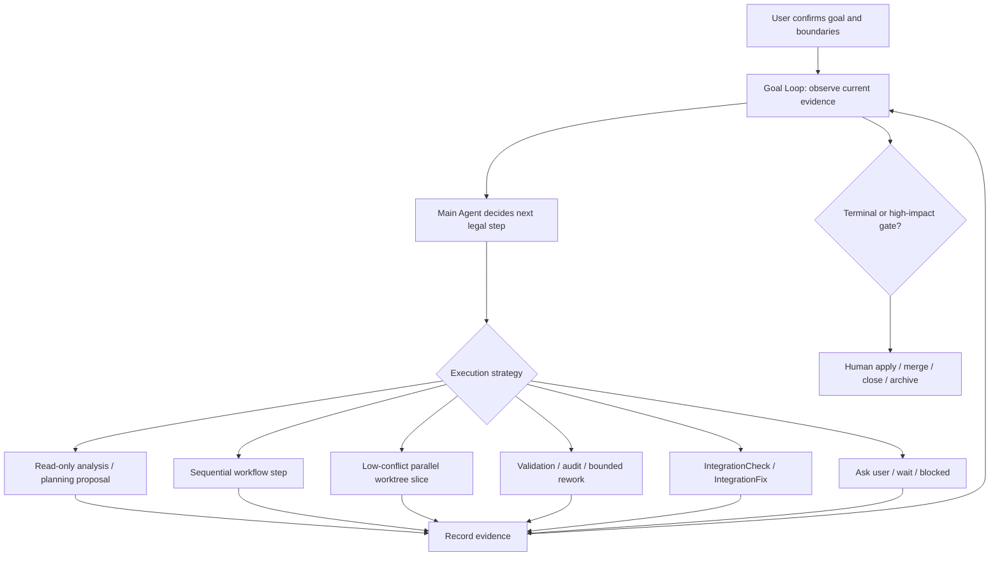

# Current Development Plan

This document preserves current roadmap and development-plan context outside the entry/handoff documents. `AGENTS.md` should stay a compact routing map, and `docs/STATUS.md` should stay a short resume point; this file carries the current plan-level summary that should not be lost during documentation compression.

## Product Shape

AHO is a local-first Agent Development OS. The user-facing model remains simple:
a project contains conversations. Conversation records are chat windows and
transcripts; durable Change, Workpad, TaskGraph, role-run, validation, audit,
apply, landing, remote handoff, and Harness evolution evidence remain explicit
Harness workflow state rather than conversation identity.

The user should not need to know internal terms before asking for work. The main conversation should explain the current understanding, accepted state, agent progress, strongest evidence, and next safe decision. Internal objects support that conversation and must not leak as required user workflow unless the UI intentionally exposes them.

## Goal-Driven Workflow Loop Target

Current implementation state: no active implementation slice.

Goal is the main Agent's visible objective brief and completion standard for a
round, reconstructed from Harness docs/evidence. It is not project memory and
not hidden durable state. Existing GoalLoop decision / packet / controller
policy artifacts are compatibility evidence for prompt context, projection
freshness, and explicit gate handoff; they are not the target architecture for
continuing to grow a backend Goal state machine. Future Goal-loop work should
keep the main Agent responsible for reading evidence, deciding whether the Goal
is complete, asking Plan Agent to revise Plan / WorkflowPlan when needed, and
letting Workflow Runtime execute only confirmed workflow input.

Latest completed implementation slice:
`harness/changes/archive/20260708-harness-workflow-runtime-feedback-rework-owner-v0/summary.md`.
It moves `pr-feedback.rework` / `pr-review.rework` behind
`workflow-runtime`, tightens single-Change Draft PR feedback lineage, and adds
`PrFeedbackReworkResult` as the canonical resolved output for downstream
agents. The result records scope, stop reason, code/validation/audit refs, and
next gate without claiming comments are resolved, approving Draft PR update, or
authorizing merge.

Previous completed implementation slice:
`harness/changes/archive/20260708-harness-workflow-runtime-source-refresh-rework-owner-v0/summary.md`.
It moves `result.refresh-rework` source-refresh rework behind
`workflow-runtime`, preserves the existing worktree-scoped prompt and
validation/audit evidence, and retired the covered source-refresh production
wrapper/export.

Previous completed implementation slice:
`harness/changes/archive/20260708-harness-workflow-runtime-top-level-role-chain-owner-v0/summary.md`.
It moves DemandWorker claimed execution and top-level role-chain action
entrypoints behind `workflow-runtime`, reuses the existing default code-change
workflow, and retires covered old production exports while leaving
source-refresh and feedback rework as explicit compatibility paths at that
time.

Previous completed implementation slice:
`harness/changes/archive/20260708-harness-workflow-runtime-scheduler-owner-v0/summary.md`.
It moves SchedulerRun-scoped worker/barrier/integration/closeout progression
behind `workflow-runtime` ownership, preserves public Scheduler action ids and
existing Scheduler evidence, and leaves full Scheduler ready-set/wave
automation as a future Workflow Runtime capability.

Previous completed implementation slice:
`harness/changes/archive/20260707-harness-workflow-runtime-taskrun-stage-v0/summary.md`.
It moves TaskRun stage execution into `workflow-runtime`, routes
`task.run.start` / `task.run.retry` and TaskQueue item stages through the new
runtime owner, preserves TaskRun/WorkerLease/code/validation/audit leaf
authorities, and deletes the old TaskRun lifecycle/resume production files.

Previous completed implementation slice:
`harness/changes/archive/20260707-harness-workflow-runtime-taskqueue-sequential-v0/summary.md`.
It moves confirmed TaskQueue sequential start/resume queue-level scheduling into
`workflow-runtime`, deletes the old queue-level `main-agent-orchestration`
runner as a production path, and left TaskRun stage execution plus Scheduler
migration for later changes at that time. New queue-level execution is
represented by WorkflowRun events plus canonical TaskQueue/TaskRun records
rather than new queue-decision evidence.

Previous completed implementation slice:
`harness/changes/archive/20260707-harness-workflow-runtime-default-code-change-v0/summary.md`.
It moves ordinary `code.run` default code-change workflow scheduling into
`HarnessWorkflowRunEngine` v0. TaskQueue, Scheduler, `task.run.start`, and
`task.run.retry` remained compatibility paths after that slice.

Previous completed implementation slice:
`harness/changes/archive/20260707-main-agent-transcript-lazy-restore-leak-fix-v1/summary.md`.
It fixed the post-handoff repair regression where opening/restoring a topic
could lazy-load persisted runtime transcript blocks back into the center
parent-agent conversation, and stopped bound conversations from redirecting
the selected topic to their bound Change.

Previous completed implementation slice:
`harness/changes/archive/20260707-main-agent-plan-handoff-pending-composer-agent-transcript-repair-v1/summary.md`.
It repairs the Plan handoff pending composer and right-side Plan Agent
transcript surface so the center conversation owns pending execute/revise
intent and the right rail shows the scoped Plan Agent conversation.

Previous completed implementation slice:
`harness/changes/archive/20260707-provider-native-a2a-real-ui-acceptance-fix-pass-v1/summary.md`.
It closes the provider-native Plan Mode / old planning-chain deletion pass:
native Codex Plan Mode now projects as `plan-session` / Plan Agent instead of a
fake `planning-agent`, old Workbench planning actions and `latest-bundle`
surfaces are removed from the product path, and real child-agent A2A remains
blocked on provider runtime events that were not observed.

Previous completed implementation slice:
`harness/changes/archive/20260706-provider-native-agent-authored-planning-v1/summary.md`.
It removes the remaining deterministic planning-content fallback. Planning
content must come from Agent-authored native plan output or an explicitly
labeled replay/fallback proposal; AHO validates, maps, persists, and gates that
content, but does not invent business goals, acceptance criteria, tasks, or
workflow body from raw user demand.

Previous completed implementation slice:
`harness/changes/archive/20260705-provider-native-a2a-runtime-alignment-v1/summary.md`.
It removes Workbench-side guessed delegation from ordinary chat and separates
provider runtime event ownership from Harness Change scope. Ordinary
main-agent conversation remains project-scoped chat. Child Agent / plan
surfaces are projected only from explicit provider runtime owner metadata or
explicit Harness workflow actions. Codex native plan and request-user-input
events belong to the `plan-session` / Plan Agent workspace unless a real
provider child-agent owner is emitted; they are not flattened into the main
transcript and do not become Harness gates or workflow truth.

Previous completed implementation slice:
`harness/changes/archive/20260704-native-codex-plan-question-flow-alignment-v1/summary.md`.
It aligns planning-agent with Codex native Plan Mode, plan streaming, and
runtime questions while keeping Harness confirmation, validation, audit,
apply, and close as the execution authority.

Previous completed implementation slice:
`harness/changes/archive/20260703-workbench-conversation-harness-identity-separation-v1/summary.md`.
It separates Workbench conversation ids from Harness Change ids. Ordinary
project-scoped main Agent chat no longer creates workflow truth; real planning,
gates, actions, apply, and close remain explicitly Change-scoped. Conversation
delete remains transcript/catalog cleanup only.

Previous completed implementation slice:
`harness/changes/archive/20260703-workbench-conversation-delete-harness-resume-entry-v1/summary.md`.
It made Workbench conversation deletion remove the conversation transcript /
catalog record only, while preserving Harness Change evidence, gates, runs,
ResumePoint, and source state.

Previous completed implementation slice:
`harness/changes/archive/20260703-main-agent-real-a2a-flow-audit-repair-v1/summary.md`.
It completes the real A2A flow audit/repair baseline for Harness-mode main
Agent conversation and right-side child-agent workspace interaction.

Previous completed implementation slice:
`harness/changes/archive/20260702-main-agent-llm-strategy-advice-production-goal-acceptance-v1/summary.md`.
It connects bounded `MainAgentStrategyAdvice` to real `chat.ask` and
`orchestrator.plan` output. The advice is requested in prompt context, parsed
from the current run, stripped from assistant text / plan output / live deltas,
and passed one-shot into the existing strategy policy. It is current-run
metadata only: replay does not read historical latest advice, workers do not
receive it, and full-access still requires `modeCompatibility.fullAccess`,
current visible gate freshness, existing allowlists, revalidation, and
ToolPolicy / action-owner checks.

Previous completed implementation slice:
`harness/changes/archive/20260702-main-agent-strategy-policy-v2b-bounded-advice-consumption/summary.md`.
It lets bounded `MainAgentStrategyAdvice` influence
`MainAgentStrategyDecision` only inside a strict current-evidence envelope,
with deterministic baseline provenance and explicit consumption status. It
does not make advice a controller, gate, action payload, scoped automation
authority, Scheduler / IntegrationCheck executor, or apply/close authority.

Previous completed implementation slice:
`harness/changes/archive/20260702-main-agent-strategy-policy-v2a-stale-first-readonly-advice/summary.md`.
It repaired V1c resume-consumption stale-first ordering and added a strict
read-only `MainAgentStrategyAdvice` contract. V2a does not let advice change
strategy kind, full-access compatibility, scoped automation eligibility,
confirmation queue behavior, action payloads, Scheduler, IntegrationCheck,
apply/close, or Harness authority.

Earlier completed implementation slice:
`harness/changes/archive/20260702-main-agent-resume-consumption-v1c-scoped-local-gated-continuation/summary.md`.
It consumes explicit main-agent resume continuation only for the
`scoped-local-automation` lane. Request-approval remains explain-only;
full-access can enter existing scoped automation only when the bound
ResumePoint and current visible primary gate match on lane, gate kind,
action/approval id, target ids, strategy kind, Change scope, and existing
allowlist status. It does not add a second controller, new action type, UI,
durable `resume-consumption.jsonl`, Scheduler/manual-gate execution,
automation allowlist entries, or Harness authority.

Previous completed implementation slice:
`harness/changes/archive/20260702-main-agent-resume-consumption-context-v1b/summary.md`.
It adds a read-only `MainAgentResumeContinuationContext` for explicit
continuation turns after a human stop, reject, discard, feedback, budget,
blocked, or stale breakpoint. The context rebuilds the current ResumePoint
stable key from current Change/gate/target, source/artifact, policy/runtime,
and feedback evidence, binds only when the latest same-project/same-Change
ResumePoint is still safe, and injects bounded quoted evidence into main-agent
chat / orchestrator prompt context. It does not enter worker role packets, UI,
action payloads, automation execution, Scheduler, IntegrationCheck, apply/close,
remote, PR, merge, or Harness evolution.

Previous completed implementation slice:
`harness/changes/archive/20260702-main-agent-resumepoint-stable-key-safety-v1a/summary.md`.
It tightens `MainAgentResumePoint` stable-key safety before resume consumption:
runtime instance ids stay in refs instead of the stable hash, write-time
validation rejects cross-Change/lane/gate/target scope drift, bind results now
distinguish stale and blocked evidence, and worker/automation behavior remains
unchanged.

Previous completed implementation slice:
`harness/changes/archive/20260702-main-agent-odwf-style-human-stop-resume-point-v1/summary.md`.
It adds ODWF-style stable-key resume evidence for main-agent human stops.
Resume points are non-executing and bind later continuation to strict
Change/gate/target/source/artifact/policy/runtime evidence instead of chat
history. They do not add UI, widen scoped automation, or change Scheduler,
IntegrationCheck, apply/close, remote, PR, merge, or Harness evolution
authority.

Previous completed implementation slice:
`harness/changes/archive/20260702-main-agent-odwf-style-strategy-policy-v1/summary.md`.
It adds ODWF-style non-executing workflow shape metadata to
`MainAgentStrategyDecision`: direct, pipeline, parallel-candidate, clarify,
blocked, terminal, and stale shape labels; bounded leaf role hints; barrier and
isolation metadata. The strategy remains deterministic and non-executing. It
does not add UI, write strategy JSONL, call LLM strategy, change automation,
Scheduler, IntegrationCheck, apply/close, remote, PR, merge, or Harness
evolution authority.

Previous completed implementation slice:
`harness/changes/archive/20260702-main-agent-strategy-consumption-readonly-safety-fix-v1/summary.md`.
It fixes the Strategy Consumption / Execution Mode Bridge read-only boundary:
scoped automation strategy prechecks now build strategy context from read-only
WorkflowGraph replay/degraded replay instead of calling the helper that records
`workflowgraph-decisions.jsonl`; the post-plan duplicate precheck was removed;
direct / sequential / complete full-access compatibility was aligned with the
existing scoped automation path; and no Harness authority, action registry,
allowlist, UI, Scheduler, IntegrationCheck, apply/close, remote, PR, merge, or
Harness evolution authority was expanded.

Previous completed implementation slice:
`harness/changes/archive/20260702-main-agent-strategy-decision-contract-v1/summary.md`.
It adds a non-executing `MainAgentStrategyDecision` contract on top of the
existing replay decision policy so Harness-mode evidence can classify direct
single-worktree, sequential WorkflowGraph, controlled Scheduler parallel
candidate, read-only/clarify, wait, blocked, complete, and stale strategy
postures. V1 is contract-only: it does not execute actions, write new JSONL,
change UI, call scoped automation, or expand Scheduler / IntegrationCheck /
apply / close / remote / PR / merge / Harness evolution authority.

Previous completed implementation slice:
`harness/changes/archive/20260702-main-agent-loop-projection-retirement-v6/summary.md`.
It retires the old Workpad/Web DTO `MainAgentLoopProjection` seam and deletes
`src/goal-loop/main-agent-loop-projection.ts`. Goal Loop summaries,
controller policy, gate-readiness preflight, feedback, close handoff, action
bridge evidence ids, main-agent loop evidence, WorkflowGraph replay/policy/
backflow, Scheduler, IntegrationCheck, confirmationQueue, action revalidation,
automation allowlists, ToolPolicyGate, apply/close, remote, PR, merge, and
Harness evolution authority remain unchanged.

Earlier completed implementation slice:
`harness/changes/archive/20260702-main-agent-old-seam-retirement-v5d-inbound-only-action-alias-finalization/summary.md`.
It finalizes legacy `role.pipeline.*` action ids as permanent inbound-only
compatibility while `main-agent.execution.*` remains the canonical public
action family. It preserves historical inbound echo evidence, tightens
generated outbound payload boundaries, and does not delete
`MainAgentLoopProjection` or any Harness authority boundary.

Previous completed implementation slice:
`harness/changes/archive/20260701-main-agent-old-seam-retirement-v5c-role-pipeline-action-alias-readiness/summary.md`.
It proves legacy `role.pipeline.*` action ids are currently only inbound
compatibility aliases while `main-agent.execution.*` is the canonical public
action family. It records the consumer inventory, tightens generated outbound
payload boundaries, and does not delete `role.pipeline.*`,
`MainAgentLoopProjection`, or any Harness authority boundary.

Earlier completed implementation slice:
`harness/changes/archive/20260701-main-agent-old-seam-retirement-v5b-remove-workpad-rolepipeline-read-model-output/summary.md`.
It removes legacy Workpad public read-model `rolePipeline` output after V5a
added canonical `mainAgentExecution`. Workbench public read-model and Web DTO
surfaces now expose only canonical `mainAgentExecution`; legacy action ids,
`MainAgentLoopProjection`, internal demand-worker `rolePipeline`, and Harness
authority boundaries remain unchanged.

Previous completed implementation slice:
`harness/changes/archive/20260701-main-agent-old-seam-retirement-v5a-rolepipeline-read-model-canonicalization/summary.md`.
It added canonical Workpad `mainAgentExecution` read-model fields with the same
wire shape as legacy `rolePipeline`, routed backend and frontend consumers
through canonical-first fallback, and kept `rolePipeline` as compatibility
output.

Previous completed implementation slice:
`harness/changes/archive/20260701-main-agent-old-seam-retirement-v4-canonical-payload-default-audit/summary.md`.
It makes `main-agent.execution.start/stop/continue/reconcile` the default
outbound payload contract and keeps `role.pipeline.start/stop/continue/reconcile`
as legacy inbound aliases. It found no production outbound generator still
emitting legacy ids and added a boundary test that whitelists legacy string
usage to registry/helper/handler alias surfaces. It does not delete
`rolePipeline`, `MainAgentLoopProjection`, or legacy aliases, and it does not
expand automation, Goal Loop, Scheduler, IntegrationCheck, ToolPolicyGate,
apply, close, remote, PR, merge, or Harness evolution authority.

Previous completed implementation slice:
`harness/changes/archive/20260701-main-agent-old-seam-retirement-v3-action-alias-compatibility-bridge/summary.md`.
It adds canonical `main-agent.execution.start/stop/continue/reconcile` action
ids while retaining `role.pipeline.start/stop/continue/reconcile` as legacy
aliases. Both id families normalize through one helper, share the same
Workbench execution handlers, labels, summaries, stop conflict-bypass behavior,
and revalidation semantics.

Previous completed implementation slice:
`harness/changes/archive/20260701-main-agent-old-seam-retirement-v2-action-normalization-bridge/summary.md`.
It centralizes legacy `role.pipeline.*` main-agent execution checks behind the
main-agent execution helper without registering canonical ids yet. V3 adds a
correction note for V2 handoff/docs coverage and completes the public action id
alias bridge.

Previous completed implementation slice:
`harness/changes/archive/20260701-main-agent-controlled-scheduler-state-backflow-v1a/summary.md`.
It fixes controlled Scheduler replay so expected SchedulerRun mismatch evidence
surfaces as an unsafe stale/scope gap, then adds a read-only in-memory
controlled Scheduler state backflow summary for the latest same-Change
SchedulerRun / SchedulerRuntimeState / latest runtime event / controlled step
refs.

Previous completed implementation slice:
`harness/changes/archive/20260701-main-agent-controlled-scheduler-result-policy-consumption-v1/summary.md`.
It adds read-only consumption of existing controlled Scheduler step evidence to
main-agent WorkflowGraph replay/policy. Replay exposes a bounded
`controlledScheduler` summary and a strict health/gap classification for
missing, malformed, old-schema, scope-mismatch, stale, and
recorded-with-warning evidence. Policy consumes that summary only as
observation posture.

Previous completed implementation slice:
`harness/changes/archive/20260701-main-agent-controlled-scheduler-step-ownership-bridge-v1/summary.md`.
It routes `planning.scheduler.controlled-advance.run` through
`runMainAgentControlledSchedulerStep(...)`: resolve the active Change, record
pre-observation, delegate one existing controlled Scheduler transition to the
Scheduler owner, and record best-effort post-observation. It does not create
Scheduler action payloads, start workers, dispatch SchedulerRun, create
WorkerLease / IntegrationCheck, or affect UI, confirmation queue, action
registry, automation, apply/close, remote, PR, merge, or Harness evolution
authority.

Previous completed implementation slice:
`harness/changes/archive/20260701-main-agent-controlled-scheduler-integration-v1/summary.md`.
It hardens Scheduler candidate observation by requiring fresh same-Change
readiness evidence to agree on `status === "ready-for-scheduler-contract"`,
`nextAllowedAction === "scheduler.contract"`, and
`schedulerEligible === true`. It also adds a non-executing controlled route
summary that says future parallel work must use the existing controlled
Scheduler owner. It does not create Scheduler action payloads, connect the
main-agent action bridge, start workers, dispatch SchedulerRun, create
WorkerLease / IntegrationCheck, or affect UI, confirmation queue, automation,
apply/close, remote, PR, merge, or Harness evolution authority.

Previous completed implementation slice:
`harness/changes/archive/20260701-main-agent-scheduler-candidate-assessment-v1/summary.md`.
It adds the non-executing `MainAgentSchedulerCandidateAssessment` layer on top
of WorkflowGraph replay/recovery. The assessment labels only whether fresh
same-Change scheduler/readiness evidence exposes a low-conflict Scheduler
candidate signal. It is not Scheduler readiness authority, not a gate, not a
recommendation, not an action payload, and not a Scheduler transition. It does
not compile, dry-run, dispatch, start workers, create SchedulerRun /
WorkerLease / IntegrationCheck, or affect UI, confirmation queue, automation,
apply/close, remote, PR, merge, or Harness evolution authority.

The target architecture is a Goal-driven Workflow Loop, not a Scheduler-first
product. After the user confirms the goal, boundaries, accepted plan, and
permission profile, the main Agent keeps a visible Goal brief and selected
Change scope in view, re-reads current evidence, chooses the next legal
strategy, records new evidence, and repeats until the demand is completed,
blocked, or reaches a high-impact human gate. The Goal brief is not hidden
project memory; cross-session recovery comes from Harness docs/evidence.

User responsibility stays small and explicit:

- state the goal and constraints in ordinary project language;
- review and correct the plan when the model's understanding is wrong;
- grant bounded execution permission for the current demand or stage;
- decide product tradeoffs, requirement clarifications, apply/merge/close, and
  other high-impact transitions.

Main-Agent responsibility is evidence-aware continuation:

- observe the current Change, accepted artifacts, source state, runs,
  validation/audit, integration evidence, Workbench gates, and user feedback;
- decide whether the next step should be read-only analysis, planning,
  sequential implementation, low-conflict parallel worktree execution,
  validation/audit, bounded rework, IntegrationCheck, IntegrationFix, waiting,
  or user clarification;
- select only legal scoped actions with current target ids and stale-target
  revalidation;
- audit completion against the original goal, accepted artifacts, current
  evidence, and human decisions.

WorkflowGraph/WorkflowRun responsibility is structure and recovery, not product
authority. DecompositionPlan, WorkflowGraphPlan, WorkflowRun, journals, recovery
keys, and pipeline/parallel barriers describe how accepted work may be
executed, resumed, or repaired. They do not replace Change/ECL truth,
validation/audit, ToolPolicyGate, or human apply/close decisions.

Scheduler responsibility is bounded execution strategy. Scheduler and worktree
paths are useful when the main Agent can prove a low-conflict write-capable
slice: independent file/module scope, fresh accepted artifacts, clean enough
source state, explicit target ids, and a legal human-confirmed gate. Scheduler
is not the whole product core, not the default answer for every TaskGraph node,
and not merge safety.

Worktrees are for isolated write-capable implementation and validation. They
are not useful for read-only analysis, planning proposal, documentation
judgment, requirement tradeoff, Workbench projection explanation, or Harness
handoff cleanup unless the task actually needs isolated source mutation.
High-conflict, dependent, ambiguous, or product-judgment-heavy slices should run
sequentially, wait for predecessor evidence, enter bounded rework /
IntegrationFix, or return to the user.



This target combines four reference lessons:

- Codex Goal: persistent objective, continuation, explicit blocked/completed
  lifecycle, and completion audit.
- Loop Engineering: act, observe evidence, reason about conflict and next step,
  repeat.
- Open Dynamic Workflows: durable workflow artifact, pipeline/parallel shape,
  evented execution, and recovery journal.
- Symphony: orchestrator-owned poll, dispatch, reconcile, retry, blocked state,
  isolated workspace, and operator-visible status.

AHO combines those lessons as Goal Loop plus typed workflow recovery plus
evidence-bound scheduler/action execution plus human gates.

## Main-Agent Continuous Orchestration Migration Roadmap

The current product has many of the required pieces: planning, Workpad,
TaskGraph, Goal Loop evidence, Scheduler evidence, scoped automation, provider
runtime readiness, and the read-only Agent orchestration graph. It still does
not have one unified main-agent continuous controller. Today, the backend can
still look like an engineering pipeline because planning confirmation, scoped
automation, role runs, validation/audit, and scheduler handoffs are connected
through separate gates and projections.

The migration target is not a new central workflow database and not an
Open Dynamic Workflows runtime copy. The target is an AHO-owned main-agent loop
above existing Harness truth:

```text
observe current Change evidence
-> decide the next legal step in user language
-> optionally delegate one bounded leaf role or expose one real Harness gate
-> record evidence/result
-> return to observe
-> stop at completed, blocked, stale, or human gate
```

Implemented migration slices now include the local role step loop, loop
evidence envelope, next-step decision evidence, non-executing action bridge
contract, TaskRun rework ownership, TaskQueue lifecycle ownership, queue step
loop, WorkflowGraph observation evidence, replay summary builder,
non-executing WorkflowGraph decision policy, centralized replay consumption,
Policy V2 replay failure-boundary hardening, explicit bridge acceptance
coverage for workflow and approval action paths, the read-only WorkflowGraph
recovery evidence summary, the non-executing Scheduler candidate assessment,
and the controlled Scheduler route hardening that keeps that candidate as a
strict non-executing signal and routes future Scheduler work toward the
existing controlled owner only, plus the controlled Scheduler step ownership
bridge that moves Workbench controlled-advance execution behind the
main-agent observation sandwich before delegating to the existing Scheduler
owner, and controlled Scheduler result/policy consumption that lets replay and
policy observe existing controlled-step evidence without making it executable.
The controlled Scheduler backflow line is now complete through IntegrationCheck
terminal posture: replay can observe candidate, handoff, exact check, outcome,
completion, and blocked closeout lineage while preserving IntegrationCheck
apply/discard as the existing human-gated owner.
Old seam retirement is now closed for the current Harness-mode main-agent
foundation: V1 inventoried live/dead seams, V2 centralized
legacy `role.pipeline.*` classification, V3 registered canonical
`main-agent.execution.*` ids while retaining legacy aliases, and V4 is making
canonical ids the default outbound payload contract while keeping legacy ids as
inbound compatibility. V5a moved Workpad projections from legacy `rolePipeline`
terminology to canonical `mainAgentExecution` while retaining legacy output for
compatibility. V5b removes that Workpad public read-model legacy output while
retaining action aliases and other live seams. V5c/V5d finalize
`role.pipeline.*` as inbound-only compatibility, and V6 retires the old
`MainAgentLoopProjection` DTO/projection seam.
The Strategy Decision Contract adds a non-executing unified strategy
classification for direct single-worktree, sequential WorkflowGraph,
controlled Scheduler parallel candidate, read-only/clarify, wait, blocked,
complete, and stale postures. The contract includes stepwise/full-access
compatibility metadata and stop conditions, but it does not consume gates,
call scoped automation, or produce executable payloads.
The Strategy Consumption / Execution Mode Bridge now consumes that strategy
only as a fail-closed precheck at existing Harness execution-mode boundaries:
`逐步确认` explains or waits on the real gate, while `自动推进` can proceed only
through existing scoped automation when the current visible primary gate is
same-Change, enabled, target-fresh, and already allowlisted/revalidated by the
existing owners.
The latest safety fix makes that consumption path read-only by deriving
strategy context from replay/degraded replay instead of recording
WorkflowGraph observation evidence during automation prechecks.
Those layers still use deterministic policy. They are architecture seams and
evidence readers, not a free-form autonomous controller.

Remaining migration should be split into reviewable structured changes:

1. Smarter main-agent decision policy: optionally replace/augment deterministic
   policies with explicit evidence-backed main-agent judgment, still behind
   existing Harness gates.
2. Normal Agent mode: design separately as a single-agent session/chat product
   mode that may reuse Provider Registry, but does not reuse Harness
   Change/ECL/validation/audit/apply/close truth.

`逐步确认` means the main agent may observe, explain, and recommend, but each
execution gate waits for the user. `自动推进` means a user-confirmed plan may
delegate only current-Change local allowed gates until a stop condition; it is
not an infinite autonomous loop. Plan confirmation, raw scheduler dispatch,
manual IntegrationCheck, integration apply/discard, PR, remote, merge, and
Harness evolution remain human-confirmed transitions.

## Current Implemented Capability Tracks

- Conversation-first Workbench: project folders contain demand conversations, parent-agent transcript surfaces, chat-only active conversation centers, Agent orchestration graph overlays, right-rail confirmation/tool surfaces, and confirmation queues. The default transcript now uses cursor-incremental SQLite message paging, a transcript shell in the default snapshot, virtual rendering, long-message folding, and `@chenglou/pretext` measurement fallback so long conversations do not require full backend transcript construction or full DOM rendering. The reading surface follows the reference-style hierarchy: user prompts are lightweight bubbles, assistant output is clean Markdown prose, and ordinary tool/process/evidence/Agent activity is compact low-noise context while errors/blockers remain visible. Main conversation UI no longer exposes a broad "details and evidence" Workpad disclosure; evidence belongs in compact activity rows, the right `诊断` / `确认` tools, or Agent graph detail projections. Synthetic 100k / 500k message pressure acceptance passed without Codex tokens or durable large fixtures; workflow truth remains Change/artifact/validation/audit/apply/close evidence, not SQLite transcript paging.
- Workbench agent orchestration surface: the selected-demand graph is now a read-only Rudder-style `Agent 编排图` with stage-based layout, avatar cards, status dots, SVG edges, and zoom/fit controls. It visualizes local loop, rework, scheduler worker branch/join, IntegrationCheck, landing, and terminal projection evidence while keeping `confirmationQueue.primary` as the only executable primary surface. The right side is a compact collapsed tool rail; expanding it exposes only real rail tools today: `确认` for the existing confirmation pane, `文件` for safe read-only project tree/preview/reference insertion, `Git` for safe read-only branch/dirty status plus staged/unstaged/untracked diff browsing inside the Git rail, and `诊断` for read-only runtime health plus bounded runtime activity log inside the diagnostics rail. Terminal is a separate Codex-style button beside the rail that opens the bottom xterm dock; it is not a right-rail tab. These tools do not execute workflow actions, change workflow authority, or occupy the center workspace by default.
- Workbench product entry: Harness mode now has a Phase 1 desktop-style entry surface aligned toward `desktop-cc-gui`: app project home, selected/direct project entry, compact project/conversation sidebar, centered `创造任何东西` composer, a working workspace picker backed by registered projects, and a real Codex-style `Codex / model / 逐步确认|自动推进` execution-mode control strip. The strip is frontend-only project/topic session state; it is not Harness workflow truth and it does not change the underlying Codex full-access runtime profile. The sidebar supports reference-style non-destructive project removal from the App list, duplicate-name path context, and archived-conversation hiding without deleting Change evidence. Settings now open as an independent center workspace with `基础 / 项目 / Codex / 技能 / 高级诊断` categories; ordinary settings avoid raw diagnostics, while Skills have a dedicated roots/list/detail management page. Codex model selection is real and reference-style: AHO reads Codex `config.toml`, best-effort reads project-scoped runtime model candidates, falls back to the Codex default, persists only selections from real candidates, ignores/cleans stale arbitrary custom model ids, and routes Codex exec/app-server runs through one effective-model resolver without editing Codex config. Skills settings support custom roots, Codex bridge sync, native Codex Skills shown as available runtime capabilities, and real `/skill-name` / `$skill-name` composer selection backed by topic-scoped runtime hints. AHO now bundles the read-only `aho-harness-onboarding` system Skill as a proposal/context aid for first onboarding, mature-project context extraction, and main-Agent delegation input; it materializes through the AHO-managed Codex bridge and never writes to global `.codex/skills`. Home and topic composers also support reference-style `@file` project file references: search is scoped to the selected project, selected refs become chips, refs bind to the first/current user message, and Codex context receives relative path/kind metadata without full-file injection. The right `文件` tool gives a read-only tree and preview that can insert the same composer file refs. The right `Git` tool gives read-only branch/dirty status, staged/unstaged/untracked lists, safe file diff preview inside the Git rail, and the same file-ref insertion path. A separate terminal toggle opens the bottom project-scoped xterm dock, while the right `诊断` tool shows read-only runtime diagnostics and runtime activity inside the diagnostics rail. Marketplace, non-Codex provider controls, browser, attachment-management controls, arbitrary custom model entry, Git write controls, and other unsupported toolbar controls remain hidden until implemented. Direct `workbench serve <path>` still auto-selects the direct project while the picker can switch to other registered projects; browser refresh restores the last valid selected project. Codex trust, Harness init, create/add project, workflow actions, apply/close, remote, merge, PR, and Harness evolution remain explicit user actions.
- Workbench planning and local autonomy: planning content is provider-native
  and Agent-authored. Codex Plan Mode native plan output is the preferred
  source; `<proposed_plan>` remains an honestly labeled replay/fallback path
  only. AHO validates, maps, persists, and gates the plan, but does not invent
  business goals, acceptance criteria, or tasks from raw user demand. Plan
  confirmation remains a human gate. The two execution modes share the local
  Goal Loop coordinator: `逐步确认` observes and leaves each current gate to the
  user, while `自动推进` may delegate allowed local gates to existing scoped
  automation after plan confirmation. Automatic advance can continue through
  local execution, validation/audit, safe `audit.accept`, local `result.apply`,
  local `landing.prepare`, and local `change.close`, then stops after archive.
- Role execution: planning/coder turns may use Codex app-server when available; `codex exec` fallback remains valid and must be labeled honestly. Validator and auditor remain independent evidence runners.
- Result safety: result review, apply readiness, source refresh rework, integration checks, aggregate validation/audit, IntegrationFix, local landing readiness, Draft PR handoff, PR feedback, ready-for-review, remote landing, and post-merge reconcile are staged and human-gated.
- Scheduler path: scheduler artifacts now cover readiness contracts, launch preflight, SchedulerRun shell, runtime reconcile/claim reservation, first/next worker start, worker result/validation/audit, bounded rework, integration candidate/handoff/outcome, terminal completion, blocked/exhausted closeout, controlled-step result summaries, controlled-loop turn route summaries, controlled loop tick contract summaries, controlled loop continuation readiness summaries, controlled loop iteration summaries, controlled stop-summary resume handoff, a fail-closed controlled-advance continuation guard, a scheduler-owned controlled-advance candidate carrier reused by Workbench confirmation/reconfirmation/current-gate proof, a scheduler-runtime controlled loop-step owner for the existing one-confirmed-transition advance wrapper, a scheduler-runtime runtime-boundary evidence summary that composes the implemented observe/choose/human-gate/dispatch/reconcile/stop phases without becoming loop authority, durable pre-dispatch continuation decision evidence on controlled-step records, an embedded post-step routing decision that names the existing owner/gate for continuation while remaining prior-turn evidence only, and real UI evidence that scoped full-access reaches scheduler only through the controlled wrapper before stopping at manual IntegrationCheck.
- Goal Loop path: GoalLoopDecision, iteration, continuation brief, next-step packet, packet freshness/parity, feedback, controller policy, controller refresh, main-Agent context, runtime prompt evidence, assisted concrete gate evidence, accepted artifact freshness, human close-gate handoff metadata, conflict reasons, Workpad read-only explanation cards, scoped start-next handoff evidence, scoped scheduler IntegrationCheck handoff evidence, scoped scheduler integration outcome handoff evidence, scoped SchedulerRun completion handoff evidence, scoped SchedulerRun blocked-closeout handoff evidence, compact SchedulerRun terminal handoff prompt evidence, compact controlled Scheduler post-step routing prompt evidence, optional controlled Scheduler post-step routing support on `GoalLoopGateReadinessPreflight`, scheduler execution-mode assessment, Workpad scheduler execution-mode surface, controller/preflight scheduler execution-mode handoff evidence, assisted concrete gate scheduler-mode consistency guard, enabled-gate projection guard, and enabled-gate server revalidation guard are implemented as non-executing evidence/context layers.
- Product maintenance/self-evolution foundation: terminal demand closeouts, append-only maintenance ledger entries, generated maintenance indexes/cache, five-terminal-change maintenance reviews, candidate scoring/review types, lifecycle-resolution evidence, canonical update proposal evidence, human-gated canonical update decision evidence, canonical patch proposal evidence, human-gated canonical patch application follow-up records, canonical patch application manifest/readiness evidence, canonical patch target descriptor evidence, human-gated canonical docs/stable-memory patch application result evidence, read-only canonical patch application observation report evidence, doc budget reports, Workbench maintenance summaries, and maintenance confirmation queue projection exist as evidence/projection layers. Automatic rewrite behavior remains future-only.
- Harness self-evolution: archive-triggered evolution can produce proposals, independent/subagent review evidence, results.tsv entries, and ECL/template deltas. The latest real-Codex acceptance window recorded `template_update / subagent_review`, adding compact prompts for real self-acceptance isolation, Workbench aggregate split evidence, no-fake real Codex evidence, and in-flight duplicate action suppression without adding product runtime behavior.
- Workbench verification: `npm run test:workbench` is the daily fast
  Workbench unit-capability gate and runs the explicit Workbench unit suites in
  one Vitest invocation. Full-chain scheduler/apply/Goal Loop deep coverage is
  retained in explicit release/deep scripts, especially
  `npm run test:workbench:release`, so ordinary product iteration is not
  blocked by the heaviest acceptance paths. The demand-to-execution golden-flow
  suite remains part of the Workbench slow/release gate, App DOM run-graph
  assertions use rendered DOM state as the primary signal, and slow acceptance
  cases carry explicit timeouts.

## Current Hard Boundaries

- Change/ECL files, accepted Spec/Plan/Tasks/AC, run artifacts, Validation, Audit, Worktree state, Apply/Close decisions, and Harness evolution records remain workflow truth.
- Workpad, Topic, TaskQueue, SchedulerRun, Goal Loop packets/policies, SQLite, Workbench projections, and UI state are coordination or evidence layers unless a later accepted architecture decision promotes them.
- Goal Loop recommendations and controller policies are explanatory evidence only. They must not execute actions, mutate source, bypass ToolPolicyGate/human gates, or become workflow truth.
- Scheduler gates remain one-confirmation-per-legal-transition. They must not become a scheduler loop, whole-wave dispatch, slot allocator, automatic child Change creator, automatic apply/merge path, or full parallel executor until explicitly designed and implemented.
- New features must prefer reusing and strengthening existing core mechanisms. Feature modules should express domain differences; cross-cutting artifact, lineage, stale-revalidation, authority, ledger, projection, gate, and ToolPolicy logic belongs in shared owners.
- Historical phase facts belong in archived summaries and `harness/changes/INDEX.json`, not in entry documents.

## Architecture Growth Control

The near-term development posture is convergence before expansion. Future structured changes should use this ladder before writing feature code: delete or no-op, reuse an existing owner/helper, extend an existing shared owner, add a reusable owner only when needed, and use feature-local logic only when the plan explains why the earlier steps are insufficient. Do not continue adding pure evidence-only, report, manifest, descriptor, or local projection phases unless they replace older complexity or clearly make a real product action reachable.

The rule is not "fewer files" or "never add modules." It is "no repeated local frameworks." A new owned module is acceptable when it becomes the reusable owner for a cross-cutting concern; a one-off helper or single-use abstraction is not architecture improvement by itself. A feature-local state machine, artifact protocol, safety gate, projection system, or ledger policy is not acceptable when an existing shared owner can be extended.

Current architecture debt register:

| Area | Convergence target | First safe move |
| --- | --- | --- |
| Maintenance / canonical patch chain | Shared artifact, lineage, target-descriptor, application-result, and observation-report handling | Pick one narrow chain and extract the smallest reusable artifact + lineage helper before touching other domains |
| Workbench projections | Shared projection summary and stale-target explanation patterns | Reuse one projection builder pattern across a repeated maintenance or scheduler surface |
| Gate/action target revalidation | Common target revalidation vocabulary across Workbench actions and assisted gates | Strengthen existing scoped action target checks instead of adding new gate-specific validators |
| Ledger and event policy | One policy for durable evidence events versus derived summaries | Record which events are canonical evidence and which summaries are projections before adding new maintenance records |
| Manager facades | Thin compatibility exports and wiring only | Keep new main logic out of broad facades; add owner modules or extend existing owners |
| Workbench test architecture | Keep Workbench regression coverage in explicit capability-domain suites and keep slow end-to-end scenarios out of ordinary unit iteration | Residual Workbench monolith is eliminated; place future Workbench tests directly in owned capability suites with shared fixture builders and explicit package script membership |

## Desktop Product Layer Roadmap

Latest reference map:
`docs/design-docs/ref-desktop-cc-gui.md`.

The local Harness/Loop engine is now far enough along that the next broad
product direction is the user-facing desktop product layer. `desktop-cc-gui`
is the closest reference for this layer because it wraps Codex, Claude Code,
OpenCode, and similar CLI agents with workspace management, chat, files, Git,
terminal, Skills, settings, diagnostics, project memory/map, and desktop
packaging. AHO should borrow those product patterns without copying its
ordinary Agent authority model into Harness mode.

Two modes are the target shape:

- Harness mode: professional development flow backed by Change/ECL, accepted
  plan/tasks, validation/audit, worktrees, IntegrationCheck, apply, landing,
  close, and Harness evolution gates.
- Normal Agent mode: future direct single-Agent conversation mode closer to
  desktop-cc-gui. It can share the same shell and tools, but it uses a simpler
  execution algorithm and must not weaken Harness mode.

Current implementation remains Codex-first. Claude Code, OpenCode, Gemini, or
other engines should be added later through a provider capability matrix and
runtime bridge, not through scattered feature-specific branches.

Staged product-layer backlog:

| Phase | Goal | Reference map domains | Done signal |
| --- | --- | --- | --- |
| 1 | Harness mode product shell | App shell/layout, Workspace/Project, Codex bridge diagnostics, Settings entry | A user can open/create/restore a project, see Codex readiness, and enter Harness Workbench without CLI setup. |
| 2 | Workbench usage layer | Chat/Composer, Plan/Tasks, file refs, slash commands, attachments, feedback affordances | A user can drive Harness mode from ordinary input, references, and confirmation feedback without learning internal object names. |
| 3 | Tool panels | Files, Git, Terminal, Runtime log | A user can inspect files/diffs/status/logs inside AHO while source mutation still routes through AHO gates. |
| 4 | Skills and provider settings | Skills/MCP, Engine/Provider, Project memory/map/context ledger | Codex tools and project memory are visible and diagnosable; future providers have explicit capability slots but are not claimed active. |
| 5 | Normal Agent mode | Shared shell plus direct Agent conversation | The same project shell can run a non-Harness single-Agent conversation while Harness mode remains separate. |
| 6 | Desktop packaging | Tauri packaging/update/security model | A packaged app can run the same local Harness behavior as the dev Workbench. |

This roadmap is not an implementation claim. It is a routing map for future
structured changes. Each phase still needs its own spec, owner modules,
source-safety and permission boundaries, targeted tests, and user-visible
acceptance.

## Desktop Native Packaging Strategy

AHO's recommended desktop direction is a hybrid architecture, not an immediate
full Rust rewrite:

```text
React UI
  -> Workbench API
  -> Node/TypeScript AHO Core
       - Harness / Change / Goal Loop / Scheduler
       - Codex bridge / Skills / SQLite / Project registry
  -> Native Adapter Layer
       - Terminal / file watcher / native dialogs / notifications
  -> Future Tauri/Rust Shell
       - window / menu / tray / updater / packaging
```

The final user-facing product should be installable as a normal desktop app
such as `.exe`, `.msi`, `.dmg`, or `.app`. Users should not need to manually
start a Node server. A future Tauri/Rust host may launch and supervise the
Node/TypeScript AHO backend as a bundled sidecar, serve the React UI, and
provide native desktop capabilities. Over time, native-heavy adapters such as
Terminal PTY or file watching may move from Node implementations to Rust
implementations behind the same service/API boundary.

This strategy preserves the existing AHO core. Harness workflow truth, Codex
runtime orchestration, Skills, Goal Loop, Scheduler, Workbench APIs, SQLite
interaction stores, and project registry behavior stay in the Node/TypeScript
core unless a later structured architecture change explicitly moves a bounded
owner. Tauri/Rust is the desktop host/native layer, not a replacement for
Change/ECL, accepted artifacts, validation/audit, apply/close, or Harness
evolution.

Future native features must name their adapter owner. For example, Terminal V1
may use Node `node-pty` through a `TerminalRuntime` owner, while a later Tauri
packaging phase may replace that implementation with Rust `portable-pty`
without changing the Workbench UI contract. Native tools must remain user
tools or runtime adapters; they must not become Agent automation channels,
workflow truth, or hidden permission bypasses.

## Next Product Direction

Pending Harness evolution: none.

Current structured change: none.

Latest architecture slice:
`harness/changes/archive/20260709-scheduler-ready-set-relationship-compression-v1/summary.md`.

Recommended current architecture step: pick one focused runtime slice after
reading `docs/design-docs/harness-workflow-runtime-target.md`. Likely
candidates are ready-set graph execution owner or broader Scheduler wave
automation. Do not combine Scheduler wave behavior with unrelated Goal loop,
Plan UI, Codex subagent, or remote/merge work.

Desktop product-layer work can continue when selected as a separate structured
product phase.

Latest product change:
`harness/changes/archive/20260708-harness-workflow-runtime-feedback-rework-owner-v0/summary.md`.

Previous product change:
`harness/changes/archive/20260708-harness-workflow-runtime-source-refresh-rework-owner-v0/summary.md`.

Earlier product change:
`harness/changes/archive/20260708-harness-workflow-runtime-top-level-role-chain-owner-v0/summary.md`.

Previous product change:
`harness/changes/archive/20260708-harness-workflow-runtime-scheduler-owner-v0/summary.md`.

Previous product change:
`harness/changes/archive/20260707-harness-workflow-runtime-taskrun-stage-v0/summary.md`.

Previous product change:
`harness/changes/archive/20260707-harness-workflow-runtime-taskqueue-sequential-v0/summary.md`.

Previous product change:
`harness/changes/archive/20260707-harness-workflow-runtime-default-code-change-v0/summary.md`.

Previous product change:
`harness/changes/archive/20260707-main-agent-transcript-lazy-restore-leak-fix-v1/summary.md`.

Previous product change:
`harness/changes/archive/20260707-main-agent-plan-handoff-pending-composer-agent-transcript-repair-v1/summary.md`.

Previous product change:
`harness/changes/archive/20260707-provider-native-a2a-real-ui-acceptance-fix-pass-v1/summary.md`.

Previous product change:
`harness/changes/archive/20260706-provider-native-agent-authored-planning-v1/summary.md`.

Previous product change:
`harness/changes/archive/20260705-provider-native-a2a-runtime-alignment-v1/summary.md`.

Latest docs/architecture change:
`harness/changes/archive/20260629-document-aho-hybrid-desktop-native-roadmap-v1/summary.md`.

Latest real UI acceptance:
`harness/changes/archive/20260702-main-agent-goal-style-real-codex-ui-acceptance-fix-pass-v1/summary.md`.

The latest real in-app browser pass verified the conversation-first main-Agent
flow: live-first user message, run-backed main-Agent reply, explicit planning
gate, planning-agent process rows, sanitized planning draft, and no automatic
code execution in stepwise mode.

Latest completed Harness evolution:
`harness/changes/archive/20260707-auto-evolve-post-workflow-runtime-taskqueue-window/summary.md`.
Decision: `docs_current_delta`; subagent Russell. Existing
ECL/BOUNDARIES/runtime-target coverage is sufficient for Workflow Runtime
default-code and TaskQueue takeover, old-runner retirement, owner-level tests,
Plan handoff UI honesty, provider-event truth, and transcript source-boundary
rules. Target-doc handoff drift was repaired; no rule/template/lint/CI/runtime
change was needed.

Current Harness evolution:

- Pending evolution: none.
- Latest completed evolution:
  `harness/changes/archive/20260708-auto-evolve-post-scheduler-owner-window/summary.md`.
  Decision: `docs_current_delta`; subagent Singer scored 85. Existing ECL,
  BOUNDARIES, and runtime-target coverage was sufficient for Workflow Runtime
  convergence and old-runner retirement; only a stale pending-evolution line in
  this current plan was repaired.
- Previous completed evolution:
  `harness/changes/archive/20260707-auto-evolve-post-workflow-runtime-taskqueue-window/summary.md`.
  Decision: `docs_current_delta`; subagent Russell. Existing
  ECL/BOUNDARIES/runtime-target coverage is sufficient for Workflow Runtime
  default-code and TaskQueue takeover, old-runner retirement, owner-level
  tests, Plan handoff UI honesty, provider-event truth, and transcript
  source-boundary rules. Target-doc handoff drift was repaired; no
  rule/template/lint/CI/runtime change was
  made.
- Previous completed evolution:
  `harness/changes/archive/20260704-auto-evolve-post-native-codex-plan-mode-window/summary.md`.
  Decision: `docs_current_delta`; existing ECL/BOUNDARIES/WORKBENCH/RUNTIME
  coverage was sufficient for native Codex Plan Mode, conversation identity,
  real UI acceptance, and A2A workspace scoping; no ECL rule, Harness
  template, lint, CI, or product runtime change was made.
- Previous completed evolution:
  `harness/changes/archive/20260702-auto-evolve-post-main-agent-strategy-consumption-window/summary.md`.
  Decision: `docs_current_delta`; subagents Beauvoir/Godel score `82/100`.
  Existing ECL/BOUNDARIES coverage was sufficient for the strategy
  decision/consumption and read-only safety archive window; no ECL rule,
  Harness template, lint, or product runtime change was made.
- Previous completed evolution:
  `harness/changes/archive/20260701-auto-evolve-post-controlled-scheduler-backflow-window/summary.md`.
  Decision: `noop`; subagent Carver score `88/100`. Existing ECL/BOUNDARIES
  coverage was sufficient for the controlled Scheduler result/state/worker/
  IntegrationCheck backflow archive window; no product runtime, Harness rule,
  or template change was made.
- Previous completed evolution:
  `harness/changes/archive/20260701-auto-evolve-post-main-agent-policy-bridge-window/summary.md`.
  Decision: `noop`; subagent Linnaeus score `92/100`. Existing ECL/BOUNDARIES
  coverage was sufficient for the main-agent replay / policy / bridge evidence
  archive window; no product runtime, Harness rule, or template change was
  made.
- Previous completed evolution:
  `harness/changes/archive/20260701-auto-evolve-post-main-agent-workflowgraph-replay-window/summary.md`.
  Decision: `noop`; subagents Bohr `91/100` and Zeno `92/100`. Existing
  ECL/BOUNDARIES coverage was sufficient for the main-agent WorkflowGraph
  queue/replay evidence archive window; no product runtime, Harness rule, or
  template change was made.
- Previous completed evolution:
  `harness/changes/archive/20260630-auto-evolve-post-main-agent-orchestration-migration-window/summary.md`.
  Decision: `noop`; existing ECL coverage was sufficient for the main-agent
  orchestration migration archive window; no product runtime, Harness rule, or
  template change was made.
- Previous completed evolution:
  `harness/changes/archive/20260629-auto-evolve-post-right-rail-git-history-window/summary.md`.
  Decision: `noop`; subagent Bernoulli score `91/100`. Existing ECL coverage was
  sufficient for the right-rail Git/diagnostics/history archive window; no
  product runtime, Harness rule, or template change was made.
- Previous completed evolution:
  `harness/changes/archive/20260629-auto-evolve-post-provider-runtime-log-window/summary.md`.
  Decision: `noop`; subagent Arendt score `90/100`. Existing ECL and boundary
  coverage was sufficient for the provider/runtime-log/private-path archive
  window; no product runtime, Harness rule, or template change was made.
- Previous completed evolution:
  `harness/changes/archive/20260629-auto-evolve-post-terminal-dock-tool-shell-window/summary.md`.
  Decision: `noop`; subagent Heisenberg score `93/100`. Existing ECL coverage
  was sufficient for the terminal/right-rail/top-tool archive window; no
  product runtime, Harness rule, or template change was made.
- Previous completed evolution:
  `harness/changes/archive/20260627-auto-evolve-post-slash-skill-window/summary.md`.
  Decision: `docs_merge`; subagent Singer score `82/100`. Existing ECL
  reference-driven UI/source, user-surface honesty, runtime bridge, and
  core-reuse coverage was sufficient; compact AGENTS/STATUS/CURRENT handoff
  alignment was applied.
- Previous completed evolution:
  `harness/changes/archive/20260627-auto-evolve-post-desktop-product-entry-window/summary.md`.
  Decision: `ecl_update`; subagent Huygens score `84/100`. Added compact
  reference-driven UI/source evidence coverage to ECL and the review template.

Choose one concrete track:

- Product capability: widen Goal-driven continuation only through existing
  legal gates, with source state, accepted artifacts, stale revalidation,
  ToolPolicyGate, and human terminal gates preserved.
- Product hardening: run a focused real UI scout only when there is a suspected
  Workbench blocker; fix the owner path rather than adding explanation layers.
- Verification cost: improve explicit release/deep members without moving slow
  coverage back into the daily Workbench gate.

## Later Roadmap Options

These remain candidates, not current implemented behavior:

- A real parallel scheduler loop or full parallel executor.
- Automatic child Change creation from accepted decomposition.
- Container or remote worker sandboxing.
- True subagent chat rather than scoped worker/task delegation.
- Richer graph animation and editable workflow canvases.
- Provider-specific landing skills, reviewer assignment, or CI drift gates.
- Dynamic MCP tool paths and richer Codex app-server request-user-input synchronization.
- Long-term memory or cached replay that is explicitly bounded by repository truth.

## Preservation Notes

The pre-compression `AGENTS.md` and `docs/STATUS.md` carried a long phase ledger. That ledger has not been treated as disposable product planning content. Its durable historical source is the archived change summaries and `harness/changes/INDEX.json`; current planning context is summarized here and in the architecture/runtime/workbench/boundary docs.
