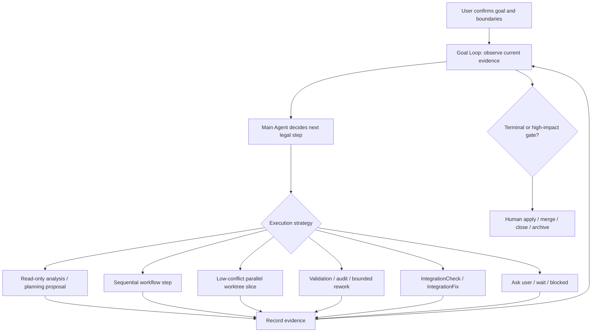

# Current Development Plan

This document preserves current roadmap and development-plan context outside the entry/handoff documents. `AGENTS.md` should stay a compact routing map, and `docs/STATUS.md` should stay a short resume point; this file carries the current plan-level summary that should not be lost during documentation compression.

## Product Shape

AHO is a local-first Agent Development OS. The user-facing model remains simple: a project contains demand conversations. The internal model binds each demand conversation to durable Change, Workpad, Topic, TaskGraph, role-run, validation, audit, apply, landing, remote handoff, and Harness evolution evidence.

The user should not need to know internal terms before asking for work. The main conversation should explain the current understanding, accepted state, agent progress, strongest evidence, and next safe decision. Internal objects support that conversation and must not leak as required user workflow unless the UI intentionally exposes them.

## Goal-Driven Workflow Loop Target

The target architecture is a Goal-driven Workflow Loop, not a Scheduler-first
product. After the user confirms the goal, boundaries, accepted plan, and
permission profile, the main Agent keeps a persistent Goal/Change in view,
re-reads current evidence, chooses the next legal strategy, records new
evidence, and repeats until the demand is completed, blocked, or reaches a
high-impact human gate.

User responsibility stays small and explicit:

- state the goal and constraints in ordinary project language;
- review and correct the plan when the model's understanding is wrong;
- grant bounded execution permission for the current demand or stage;
- decide product tradeoffs, requirement clarifications, apply/merge/close, and
  other high-impact transitions.

Main-Agent responsibility is evidence-aware continuation:

- observe the current Change, accepted artifacts, source state, runs,
  validation/audit, integration evidence, Workbench gates, and user feedback;
- decide whether the next step should be read-only analysis, planning,
  sequential implementation, low-conflict parallel worktree execution,
  validation/audit, bounded rework, IntegrationCheck, IntegrationFix, waiting,
  or user clarification;
- select only legal scoped actions with current target ids and stale-target
  revalidation;
- audit completion against the original goal, accepted artifacts, current
  evidence, and human decisions.

WorkflowGraph/WorkflowRun responsibility is structure and recovery, not product
authority. DecompositionPlan, WorkflowGraphPlan, WorkflowRun, journals, recovery
keys, and pipeline/parallel barriers describe how accepted work may be
executed, resumed, or repaired. They do not replace Change/ECL truth,
validation/audit, ToolPolicyGate, or human apply/close decisions.

Scheduler responsibility is bounded execution strategy. Scheduler and worktree
paths are useful when the main Agent can prove a low-conflict write-capable
slice: independent file/module scope, fresh accepted artifacts, clean enough
source state, explicit target ids, and a legal human-confirmed gate. Scheduler
is not the whole product core, not the default answer for every TaskGraph node,
and not merge safety.

Worktrees are for isolated write-capable implementation and validation. They
are not useful for read-only analysis, planning proposal, documentation
judgment, requirement tradeoff, Workbench projection explanation, or Harness
handoff cleanup unless the task actually needs isolated source mutation.
High-conflict, dependent, ambiguous, or product-judgment-heavy slices should run
sequentially, wait for predecessor evidence, enter bounded rework /
IntegrationFix, or return to the user.

This target combines four reference lessons:

- Codex Goal: persistent objective, continuation, explicit blocked/completed
  lifecycle, and completion audit.
- Loop Engineering: act, observe evidence, reason about conflict and next step,
  repeat.
- Open Dynamic Workflows: durable workflow artifact, pipeline/parallel shape,
  evented execution, and recovery journal.
- Symphony: orchestrator-owned poll, dispatch, reconcile, retry, blocked state,
  isolated workspace, and operator-visible status.

AHO combines those lessons as Goal Loop plus typed workflow recovery plus
evidence-bound scheduler/action execution plus human gates.

## Current Implemented Capability Tracks

- Conversation-first Workbench: project folders contain demand conversations, parent-agent transcript surfaces, inline run graph tabs, Workpad summaries, evidence/detail surfaces, and confirmation queues.
- Role execution: planning/coder turns may use Codex app-server when available; `codex exec` fallback remains valid and must be labeled honestly. Validator and auditor remain independent evidence runners.
- Result safety: result review, apply readiness, source refresh rework, integration checks, aggregate validation/audit, IntegrationFix, local landing readiness, Draft PR handoff, PR feedback, ready-for-review, remote landing, and post-merge reconcile are staged and human-gated.
- Scheduler path: scheduler artifacts now cover readiness contracts, launch preflight, SchedulerRun shell, runtime reconcile/claim reservation, first/next worker start, worker result/validation/audit, bounded rework, integration candidate/handoff/outcome, terminal completion, blocked/exhausted closeout, controlled-step result summaries, controlled-loop turn route summaries, controlled loop tick contract summaries, controlled loop continuation readiness summaries, controlled loop iteration summaries, controlled stop-summary resume handoff, a fail-closed controlled-advance continuation guard, a scheduler-owned controlled-advance candidate carrier reused by Workbench confirmation/reconfirmation/current-gate proof, a scheduler-runtime controlled loop-step owner for the existing one-confirmed-transition advance wrapper, a scheduler-runtime runtime-boundary evidence summary that composes the implemented observe/choose/human-gate/dispatch/reconcile/stop phases without becoming loop authority, durable pre-dispatch continuation decision evidence on controlled-step records, and an embedded post-step routing decision that names the existing owner/gate for continuation while remaining prior-turn evidence only.
- Goal Loop path: GoalLoopDecision, iteration, continuation brief, next-step packet, packet freshness/parity, feedback, controller policy, controller refresh, main-Agent context, runtime prompt evidence, assisted concrete gate evidence, accepted artifact freshness, human close-gate handoff metadata, conflict reasons, Workpad read-only explanation cards, scoped start-next handoff evidence, scoped scheduler IntegrationCheck handoff evidence, scoped scheduler integration outcome handoff evidence, scoped SchedulerRun completion handoff evidence, scoped SchedulerRun blocked-closeout handoff evidence, compact SchedulerRun terminal handoff prompt evidence, compact controlled Scheduler post-step routing prompt evidence, optional controlled Scheduler post-step routing support on `GoalLoopGateReadinessPreflight`, scheduler execution-mode assessment, Workpad scheduler execution-mode surface, controller/preflight scheduler execution-mode handoff evidence, assisted concrete gate scheduler-mode consistency guard, enabled-gate projection guard, and enabled-gate server revalidation guard are implemented as non-executing evidence/context layers.
- Product maintenance/self-evolution foundation: terminal demand closeouts, append-only maintenance ledger entries, generated maintenance indexes/cache, five-terminal-change maintenance reviews, candidate scoring/review types, lifecycle-resolution evidence, canonical update proposal evidence, human-gated canonical update decision evidence, canonical patch proposal evidence, human-gated canonical patch application follow-up records, canonical patch application manifest/readiness evidence, canonical patch target descriptor evidence, human-gated canonical docs/stable-memory patch application result evidence, read-only canonical patch application observation report evidence, doc budget reports, Workbench maintenance summaries, and maintenance confirmation queue projection exist as evidence/projection layers. Automatic rewrite behavior remains future-only.
- Harness self-evolution: archive-triggered evolution can produce proposals, independent/subagent review evidence, results.tsv entries, and ECL/template deltas. The latest real-Codex acceptance window recorded `template_update / subagent_review`, adding compact prompts for real self-acceptance isolation, Workbench aggregate split evidence, no-fake real Codex evidence, and in-flight duplicate action suppression without adding product runtime behavior.
- Workbench verification: `npm run test:workbench` now has explicit Workbench unit, scheduler-slow, slow, and aggregate layers. The residual scheduler slow monolith is split into capability-domain suites, the demand-to-execution golden-flow suite is part of the Workbench slow gate, App DOM run-graph assertions use rendered DOM state as the primary signal, and slow acceptance cases now carry explicit timeouts. The remaining Workbench aggregate issue is runtime cost: split members pass, while the full aggregate can exceed ordinary tool windows.

## Current Hard Boundaries

- Change/ECL files, accepted Spec/Plan/Tasks/AC, run artifacts, Validation, Audit, Worktree state, Apply/Close decisions, and Harness evolution records remain workflow truth.
- Workpad, Topic, TaskQueue, SchedulerRun, Goal Loop packets/policies, SQLite, Workbench projections, and UI state are coordination or evidence layers unless a later accepted architecture decision promotes them.
- Goal Loop recommendations and controller policies are explanatory evidence only. They must not execute actions, mutate source, bypass ToolPolicyGate/human gates, or become workflow truth.
- Scheduler gates remain one-confirmation-per-legal-transition. They must not become a scheduler loop, whole-wave dispatch, slot allocator, automatic child Change creator, automatic apply/merge path, or full parallel executor until explicitly designed and implemented.
- New features must prefer reusing and strengthening existing core mechanisms. Feature modules should express domain differences; cross-cutting artifact, lineage, stale-revalidation, authority, ledger, projection, gate, and ToolPolicy logic belongs in shared owners.
- Historical phase facts belong in archived summaries and `harness/changes/INDEX.json`, not in entry documents.

## Architecture Growth Control

The near-term development posture is convergence before expansion. Future structured changes should first ask which core mechanism they reuse or strengthen, and only then add feature-specific behavior. Do not continue adding pure evidence-only, report, manifest, descriptor, or local projection phases unless they reuse an existing core mechanism and clearly lower the cost of later similar work.

The rule is not "fewer files" or "never add modules." It is "no repeated local frameworks." A new owned module is acceptable when it becomes the reusable owner for a cross-cutting concern; a feature-local state machine, artifact protocol, safety gate, projection system, or ledger policy is not acceptable when an existing shared owner can be extended.

Current architecture debt register:

| Area | Convergence target | First safe move |
| --- | --- | --- |
| Maintenance / canonical patch chain | Shared artifact, lineage, target-descriptor, application-result, and observation-report handling | Pick one narrow chain and extract the smallest reusable artifact + lineage helper before touching other domains |
| Workbench projections | Shared projection summary and stale-target explanation patterns | Reuse one projection builder pattern across a repeated maintenance or scheduler surface |
| Gate/action target revalidation | Common target revalidation vocabulary across Workbench actions and assisted gates | Strengthen existing scoped action target checks instead of adding new gate-specific validators |
| Ledger and event policy | One policy for durable evidence events versus derived summaries | Record which events are canonical evidence and which summaries are projections before adding new maintenance records |
| Manager facades | Thin compatibility exports and wiring only | Keep new main logic out of broad facades; add owner modules or extend existing owners |
| Workbench test architecture | Keep Workbench regression coverage in explicit capability-domain suites and keep slow end-to-end scenarios out of ordinary unit iteration | Residual Workbench monolith is eliminated; place future Workbench tests directly in owned capability suites with shared fixture builders and explicit package script membership |

## Next Product Direction

A structured product or Harness evolution change is not currently active. The
latest Harness evolution is archived at
`harness/changes/archive/20260623-auto-evolve-harness-real-codex-acceptance-window/summary.md`.
The latest product projection fix is archived at
`harness/changes/archive/20260623-workbench-close-gate-projection-alignment/summary.md`.
It fixed the bounded Workbench projection gap found during final close: when a
selected demand has a real `change.close` approval, both the authoritative
confirmation queue and `decisionInspector.primary` now show the close gate, and
stale failure/result context remains related or historical evidence.

The current-project real Codex acceptance is archived at
`harness/changes/archive/20260623-workbench-current-project-real-codex-acceptance/summary.md`.
It validated the current AHO repository itself through real
Workbench/Codex/manual-gated paths, not fixture or fake Codex paths. External
sandbox `a10` resolved the Codex startup blocker, isolated worktree dependency
setup blocker, same-root source-safety blocker, duplicate in-flight action
blocker, missing local committed-apply close path, and committed-apply landing
attribution blocker. It reached real UI planning, decomposition/readiness,
`code.run`, validation failure, bounded rework, validation pass, audit
`approved`, UI `audit.accept`, human-gated `result.apply` with local commit,
landing readiness refresh, and human-confirmed close/archive without remote
PR/push/merge.

The archive-threshold Harness evolution window has been handled. The
close-gate projection follow-up from final close has also been handled, so the
next structured product slice should address the next concrete Workbench
product blocker found by real/manual UI use before expanding automation.

The latest archived `workbench-verification-signal-stability` change made
Workbench aggregate verification trustworthy again: `npm run test:workbench`
passes through explicit unit / scheduler-slow / slow / aggregate layers, the
stale App DOM fetch mock and controlled-advance test expectations are fixed,
and the demand-to-execution golden-flow suite is part of the Workbench slow
gate.

The earlier `workbench-demand-to-execution-golden-flow` change proved the front
half of the manual loop: natural-language Workbench demand, planning draft,
execution confirmation, decomposition/readiness, readiness-scoped `code.run`,
and validation/audit/result evidence. The
`workbench-usable-manual-closed-loop` change proved the back half from result
review through validation/audit, human-confirmed apply, and separate
human-confirmed close/archive handoff.

The current product baseline is a real-accepted local Workbench manual-gated
path from demand conversation to committed apply and close/archive. Real
self-acceptance must keep the AHO development repository separate from the
managed project under test. Future product work should build on existing
Workbench action registry, scoped target revalidation, ToolPolicy/human gates,
typed workflow artifacts, readiness manifests, code runtime orchestration,
validation/audit, source apply safety, and close/archive handoff. The active
real-acceptance blocker should be resolved or intentionally parked before
expanding automation.

The next architecture direction should be evaluated against the
Goal-driven Workflow Loop target above. Product work should avoid treating every
TaskGraph node as a worktree job, avoid making Scheduler the product core, and
avoid exposing future workflow internals as primary user actions. Parallel
worktree execution belongs only to low-conflict write-capable slices selected
by the main Agent; sequential loop turns, read-only planning, bounded rework,
IntegrationFix, and human clarification remain equally valid strategies.

Full-auto task mode remains a later product direction. A separate accepted
change may design scoped automation authorization from the main conversation for
the current demand / Change / accepted plan / permission profile / source state
hash. Remote PR/update/ready/merge behavior must remain behind a later explicit
profile. The Phase 12A controlled loop boundary lives in
`docs/design-docs/controlled-scheduler-loop.md` and remains the implementation
constraint for future scheduler automation. Historical phase-by-phase details
stay in archived summaries and `harness/changes/INDEX.json`.

- If continuing product implementation, harden the proven Workbench
  manual-gated loop with concrete product blockers.
- If improving test architecture, reduce the still-expensive scheduler slow
  runtime without dropping scheduler/runtime/source-safety assertions or
  recreating a residual Workbench monolith.
- If exploring broader automation, open a separate full-auto design slice that
  explicitly reuses the proven gates and source safety.
- If continuing Goal Loop work, build on controller policy evidence without making it execution authority.
- If continuing scheduler work, use `docs/design-docs/controlled-scheduler-loop.md` as the loop boundary, but keep runtime staged and human-gated until an accepted ECL change implements and verifies each transition.
- If improving Workbench UX, keep implemented actions honest and bind every high-impact action to concrete target ids, stale revalidation, ToolPolicyGate, and human confirmation.
- If adding Workbench tests, keep new coverage in explicit capability-domain suites and do not recreate a residual Workbench monolith; do not mix test topology work into unrelated product behavior changes.
- If improving product maintenance/self-evolution, treat raw closeouts/ledgers as durable evidence and current stable memory/docs as compact derived memory. Build only on the Phase 12P-12V human-gated proposal/decision/patch/gate/manifest/descriptor/application-result chain before considering any broader rewrite behavior.
- If improving Harness self-evolution, use the Experience Lifecycle scan: promote, retain, merge, retire, and archive-only.

## Later Roadmap Options

These remain candidates, not current implemented behavior:

- A real parallel scheduler loop or full parallel executor.
- Automatic child Change creation from accepted decomposition.
- Container or remote worker sandboxing.
- True subagent chat rather than scoped worker/task delegation.
- Richer graph animation and editable workflow canvases.
- Provider-specific landing skills, reviewer assignment, or CI drift gates.
- Dynamic MCP tool paths and richer Codex app-server request-user-input synchronization.
- Long-term memory or cached replay that is explicitly bounded by repository truth.

## Preservation Notes

The pre-compression `AGENTS.md` and `docs/STATUS.md` carried a long phase ledger. That ledger has not been treated as disposable product planning content. Its durable historical source is the archived change summaries and `harness/changes/INDEX.json`; current planning context is summarized here and in the architecture/runtime/workbench/boundary docs.
