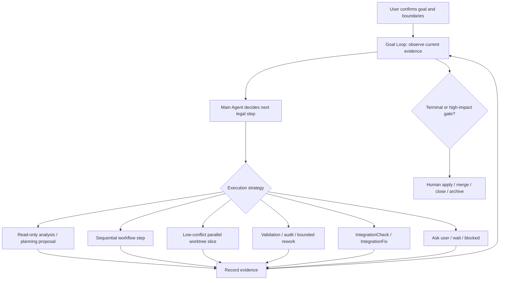

# Current Development Plan

This document preserves current roadmap and development-plan context outside the entry/handoff documents. `AGENTS.md` should stay a compact routing map, and `docs/STATUS.md` should stay a short resume point; this file carries the current plan-level summary that should not be lost during documentation compression.

## Product Shape

AHO is a local-first Agent Development OS. The user-facing model remains simple: a project contains demand conversations. The internal model binds each demand conversation to durable Change, Workpad, Topic, TaskGraph, role-run, validation, audit, apply, landing, remote handoff, and Harness evolution evidence.

The user should not need to know internal terms before asking for work. The main conversation should explain the current understanding, accepted state, agent progress, strongest evidence, and next safe decision. Internal objects support that conversation and must not leak as required user workflow unless the UI intentionally exposes them.

## Goal-Driven Workflow Loop Target

Latest implementation slice:
`harness/changes/archive/20260626-workbench-mode-aware-local-goal-loop-v1/summary.md`.
It adds a thin mode-aware local Goal Loop coordinator. `请求批准` and
`完全访问权限` now observe the same selected-Change primary gate; request
approval waits on the existing confirmation queue, while full access delegates
only allowed local gates to existing scoped automation after the human plan
confirmation. It did not implement a new workflow runtime, full parallel
executor, automatic IntegrationCheck, integration apply/discard, PR, remote,
merge, or Harness evolution.

The target architecture is a Goal-driven Workflow Loop, not a Scheduler-first
product. After the user confirms the goal, boundaries, accepted plan, and
permission profile, the main Agent keeps a persistent Goal/Change in view,
re-reads current evidence, chooses the next legal strategy, records new
evidence, and repeats until the demand is completed, blocked, or reaches a
high-impact human gate.

User responsibility stays small and explicit:

- state the goal and constraints in ordinary project language;
- review and correct the plan when the model's understanding is wrong;
- grant bounded execution permission for the current demand or stage;
- decide product tradeoffs, requirement clarifications, apply/merge/close, and
  other high-impact transitions.

Main-Agent responsibility is evidence-aware continuation:

- observe the current Change, accepted artifacts, source state, runs,
  validation/audit, integration evidence, Workbench gates, and user feedback;
- decide whether the next step should be read-only analysis, planning,
  sequential implementation, low-conflict parallel worktree execution,
  validation/audit, bounded rework, IntegrationCheck, IntegrationFix, waiting,
  or user clarification;
- select only legal scoped actions with current target ids and stale-target
  revalidation;
- audit completion against the original goal, accepted artifacts, current
  evidence, and human decisions.

WorkflowGraph/WorkflowRun responsibility is structure and recovery, not product
authority. DecompositionPlan, WorkflowGraphPlan, WorkflowRun, journals, recovery
keys, and pipeline/parallel barriers describe how accepted work may be
executed, resumed, or repaired. They do not replace Change/ECL truth,
validation/audit, ToolPolicyGate, or human apply/close decisions.

Scheduler responsibility is bounded execution strategy. Scheduler and worktree
paths are useful when the main Agent can prove a low-conflict write-capable
slice: independent file/module scope, fresh accepted artifacts, clean enough
source state, explicit target ids, and a legal human-confirmed gate. Scheduler
is not the whole product core, not the default answer for every TaskGraph node,
and not merge safety.

Worktrees are for isolated write-capable implementation and validation. They
are not useful for read-only analysis, planning proposal, documentation
judgment, requirement tradeoff, Workbench projection explanation, or Harness
handoff cleanup unless the task actually needs isolated source mutation.
High-conflict, dependent, ambiguous, or product-judgment-heavy slices should run
sequentially, wait for predecessor evidence, enter bounded rework /
IntegrationFix, or return to the user.

This target combines four reference lessons:

- Codex Goal: persistent objective, continuation, explicit blocked/completed
  lifecycle, and completion audit.
- Loop Engineering: act, observe evidence, reason about conflict and next step,
  repeat.
- Open Dynamic Workflows: durable workflow artifact, pipeline/parallel shape,
  evented execution, and recovery journal.
- Symphony: orchestrator-owned poll, dispatch, reconcile, retry, blocked state,
  isolated workspace, and operator-visible status.

AHO combines those lessons as Goal Loop plus typed workflow recovery plus
evidence-bound scheduler/action execution plus human gates.

## Current Implemented Capability Tracks

- Conversation-first Workbench: project folders contain demand conversations, parent-agent transcript surfaces, inline run graph tabs, Workpad summaries, evidence/detail surfaces, and confirmation queues.
- Workbench planning and local autonomy: planning generation prefers Codex Plan Mode proposal capture and records `proposedPlanMd`; when native plan deltas are unavailable it uses the prompt-level `<proposed_plan>` fallback. Plan confirmation remains a human gate. The two execution modes share the local Goal Loop coordinator: `请求批准` observes and leaves each current gate to the user, while `完全访问权限` may delegate allowed local gates to existing scoped automation after plan confirmation. Full-access can continue through local execution, validation/audit, safe `audit.accept`, local `result.apply`, local `landing.prepare`, and local `change.close`, then stops after archive.
- Role execution: planning/coder turns may use Codex app-server when available; `codex exec` fallback remains valid and must be labeled honestly. Validator and auditor remain independent evidence runners.
- Result safety: result review, apply readiness, source refresh rework, integration checks, aggregate validation/audit, IntegrationFix, local landing readiness, Draft PR handoff, PR feedback, ready-for-review, remote landing, and post-merge reconcile are staged and human-gated.
- Scheduler path: scheduler artifacts now cover readiness contracts, launch preflight, SchedulerRun shell, runtime reconcile/claim reservation, first/next worker start, worker result/validation/audit, bounded rework, integration candidate/handoff/outcome, terminal completion, blocked/exhausted closeout, controlled-step result summaries, controlled-loop turn route summaries, controlled loop tick contract summaries, controlled loop continuation readiness summaries, controlled loop iteration summaries, controlled stop-summary resume handoff, a fail-closed controlled-advance continuation guard, a scheduler-owned controlled-advance candidate carrier reused by Workbench confirmation/reconfirmation/current-gate proof, a scheduler-runtime controlled loop-step owner for the existing one-confirmed-transition advance wrapper, a scheduler-runtime runtime-boundary evidence summary that composes the implemented observe/choose/human-gate/dispatch/reconcile/stop phases without becoming loop authority, durable pre-dispatch continuation decision evidence on controlled-step records, and an embedded post-step routing decision that names the existing owner/gate for continuation while remaining prior-turn evidence only.
- Goal Loop path: GoalLoopDecision, iteration, continuation brief, next-step packet, packet freshness/parity, feedback, controller policy, controller refresh, main-Agent context, runtime prompt evidence, assisted concrete gate evidence, accepted artifact freshness, human close-gate handoff metadata, conflict reasons, Workpad read-only explanation cards, scoped start-next handoff evidence, scoped scheduler IntegrationCheck handoff evidence, scoped scheduler integration outcome handoff evidence, scoped SchedulerRun completion handoff evidence, scoped SchedulerRun blocked-closeout handoff evidence, compact SchedulerRun terminal handoff prompt evidence, compact controlled Scheduler post-step routing prompt evidence, optional controlled Scheduler post-step routing support on `GoalLoopGateReadinessPreflight`, scheduler execution-mode assessment, Workpad scheduler execution-mode surface, controller/preflight scheduler execution-mode handoff evidence, assisted concrete gate scheduler-mode consistency guard, enabled-gate projection guard, and enabled-gate server revalidation guard are implemented as non-executing evidence/context layers.
- Product maintenance/self-evolution foundation: terminal demand closeouts, append-only maintenance ledger entries, generated maintenance indexes/cache, five-terminal-change maintenance reviews, candidate scoring/review types, lifecycle-resolution evidence, canonical update proposal evidence, human-gated canonical update decision evidence, canonical patch proposal evidence, human-gated canonical patch application follow-up records, canonical patch application manifest/readiness evidence, canonical patch target descriptor evidence, human-gated canonical docs/stable-memory patch application result evidence, read-only canonical patch application observation report evidence, doc budget reports, Workbench maintenance summaries, and maintenance confirmation queue projection exist as evidence/projection layers. Automatic rewrite behavior remains future-only.
- Harness self-evolution: archive-triggered evolution can produce proposals, independent/subagent review evidence, results.tsv entries, and ECL/template deltas. The latest real-Codex acceptance window recorded `template_update / subagent_review`, adding compact prompts for real self-acceptance isolation, Workbench aggregate split evidence, no-fake real Codex evidence, and in-flight duplicate action suppression without adding product runtime behavior.
- Workbench verification: `npm run test:workbench` is the daily fast
  Workbench unit-capability gate and runs the explicit Workbench unit suites in
  one Vitest invocation. Full-chain scheduler/apply/Goal Loop deep coverage is
  retained in explicit release/deep scripts, especially
  `npm run test:workbench:release`, so ordinary product iteration is not
  blocked by the heaviest acceptance paths. The demand-to-execution golden-flow
  suite remains part of the Workbench slow/release gate, App DOM run-graph
  assertions use rendered DOM state as the primary signal, and slow acceptance
  cases carry explicit timeouts.

## Current Hard Boundaries

- Change/ECL files, accepted Spec/Plan/Tasks/AC, run artifacts, Validation, Audit, Worktree state, Apply/Close decisions, and Harness evolution records remain workflow truth.
- Workpad, Topic, TaskQueue, SchedulerRun, Goal Loop packets/policies, SQLite, Workbench projections, and UI state are coordination or evidence layers unless a later accepted architecture decision promotes them.
- Goal Loop recommendations and controller policies are explanatory evidence only. They must not execute actions, mutate source, bypass ToolPolicyGate/human gates, or become workflow truth.
- Scheduler gates remain one-confirmation-per-legal-transition. They must not become a scheduler loop, whole-wave dispatch, slot allocator, automatic child Change creator, automatic apply/merge path, or full parallel executor until explicitly designed and implemented.
- New features must prefer reusing and strengthening existing core mechanisms. Feature modules should express domain differences; cross-cutting artifact, lineage, stale-revalidation, authority, ledger, projection, gate, and ToolPolicy logic belongs in shared owners.
- Historical phase facts belong in archived summaries and `harness/changes/INDEX.json`, not in entry documents.

## Architecture Growth Control

The near-term development posture is convergence before expansion. Future structured changes should use this ladder before writing feature code: delete or no-op, reuse an existing owner/helper, extend an existing shared owner, add a reusable owner only when needed, and use feature-local logic only when the plan explains why the earlier steps are insufficient. Do not continue adding pure evidence-only, report, manifest, descriptor, or local projection phases unless they replace older complexity or clearly make a real product action reachable.

The rule is not "fewer files" or "never add modules." It is "no repeated local frameworks." A new owned module is acceptable when it becomes the reusable owner for a cross-cutting concern; a one-off helper or single-use abstraction is not architecture improvement by itself. A feature-local state machine, artifact protocol, safety gate, projection system, or ledger policy is not acceptable when an existing shared owner can be extended.

Current architecture debt register:

| Area | Convergence target | First safe move |
| --- | --- | --- |
| Maintenance / canonical patch chain | Shared artifact, lineage, target-descriptor, application-result, and observation-report handling | Pick one narrow chain and extract the smallest reusable artifact + lineage helper before touching other domains |
| Workbench projections | Shared projection summary and stale-target explanation patterns | Reuse one projection builder pattern across a repeated maintenance or scheduler surface |
| Gate/action target revalidation | Common target revalidation vocabulary across Workbench actions and assisted gates | Strengthen existing scoped action target checks instead of adding new gate-specific validators |
| Ledger and event policy | One policy for durable evidence events versus derived summaries | Record which events are canonical evidence and which summaries are projections before adding new maintenance records |
| Manager facades | Thin compatibility exports and wiring only | Keep new main logic out of broad facades; add owner modules or extend existing owners |
| Workbench test architecture | Keep Workbench regression coverage in explicit capability-domain suites and keep slow end-to-end scenarios out of ordinary unit iteration | Residual Workbench monolith is eliminated; place future Workbench tests directly in owned capability suites with shared fixture builders and explicit package script membership |

## Next Product Direction

Current structured change: none.

Latest real UI acceptance:
`harness/changes/archive/20260626-workbench-mode-aware-local-goal-loop-real-ui-acceptance-v1/summary.md`.

The mode-aware local Goal Loop now has real in-app browser evidence:
request-approval waits on the real next gate, full-access can complete a
sequential local apply/landing/close path, and full-access stops before raw
scheduler preparation.

Latest completed Harness evolution:
`harness/changes/archive/20260626-auto-evolve-post-mode-aware-loop-window/summary.md`.
Decision: `docs_merge`; subagent Aquinas score `86/100`. No new product
runtime, ECL rule, template field, or lint rule was justified. The durable
change was compact current-doc alignment.

Latest product change:
`harness/changes/archive/20260626-workbench-mode-aware-local-goal-loop-v1/summary.md`.
It adds the first thin mode-aware local Goal Loop coordinator over existing
Workbench gates: `请求批准` waits on the confirmation queue, while
`完全访问权限` delegates allowed local gates to existing scoped automation after
human plan confirmation.

Current baseline:

- One loop execution is scoped to one parent Change. A long-lived demand may
  continue through later loops, but each later implementation loop is a new
  Change. Multi-worktree outputs may feed IntegrationCheck only within the
  same Change; cross-Change merge must be a future explicit higher-level
  merge/landing design.
- Local manual-gated Workbench loop has real browser acceptance from ordinary
  demand through planning, decomposition/readiness, real `coder-codex`
  execution, validation/audit, result review, human apply, and close/archive.
- Two-tier scoped automation is available on the ordinary Workbench surface:
  `请求批准` observes the same local loop and leaves each current gate to the
  user, while `完全访问权限` may automatically consume selected-Change local
  gates from the allowed set after human plan confirmation.
- Codex runtime full-access capability is evidence of executor capability only;
  AHO workflow authority remains scoped to target ids, source state, accepted
  artifacts, stale revalidation, ToolPolicyGate, validation/audit, and the
  local terminal gates explicitly included in the current Change
  authorization.
- Daily `npm run test:workbench` is the fast Workbench unit-capability gate;
  full-chain scheduler/apply/Goal Loop coverage remains in explicit
  release/deep scripts such as `npm run test:workbench:release`.
- Low-conflict TaskGraph reachability has implemented strict explicit
  source-scope readiness and user-facing scheduler copy hardening. E-drive real
  UI acceptance with dependencies installed reached two real scheduler worker
  `coder-codex` worktrees, worker validation/audit, and a ready integration
  candidate. The raw `planning.scheduler.integration-check.run` gate stayed
  manual. After manual confirmation, existing IntegrationCheck ran aggregate
  validation/audit, passed, and stopped at the existing human integration
  apply/discard gate; source root stayed clean. Scoped automation now records
  the handoff to manual IntegrationCheck as `terminal-human-gate` when it is
  the fresh next gate after a budgeted controlled continuation, instead of
  reporting a generic `max-steps` stop.
- Integration apply/discard remains a high-impact human decision. Apply keeps
  source clean, HEAD, artifact hash, aggregate validation, and audit guards;
  discard now also fails closed in the handler for terminal or non-discardable
  check states. The latest real UI acceptance proves a repaired IntegrationFix
  artifact can be applied through this human gate and then stops showing the
  old apply/discard gate as primary.
- Local landing after integration apply is verified through `landing.prepare`
  and a ready landing package. The local terminal surface now resolves to
  `change.close` when the existing close gate is ready, or to an explicit local
  terminal blocker when close requirements are not yet satisfied; PR/provider
  readiness does not override the local-only primary path.
- External-local restore is implemented for direct `workbench serve <path>`.
  When a source marker and the current `AHO_HOME/projects/<projectId>` memory
  exist, Workbench restores a session-scoped direct project, lists existing
  conversations/gates, and shows Harness-ready memory without writing the
  registry or mutating the source root. Missing memory is shown as an explicit
  `AHO_HOME` mismatch.

Current Harness evolution:

- Pending evolution: none.
- Latest completed evolution:
  `harness/changes/archive/20260626-auto-evolve-post-mode-aware-loop-window/summary.md`.
  Detailed sandbox evidence, old blocker history, ports, hashes, and run ids
  remain archive-only.

Choose one concrete track:

- Product capability: widen Goal-driven continuation only through existing
  legal gates, with source state, accepted artifacts, stale revalidation,
  ToolPolicyGate, and human terminal gates preserved.
- Product hardening: run a focused real UI scout only when there is a suspected
  Workbench blocker; fix the owner path rather than adding explanation layers.
- Verification cost: improve explicit release/deep members without moving slow
  coverage back into the daily Workbench gate.

## Later Roadmap Options

These remain candidates, not current implemented behavior:

- A real parallel scheduler loop or full parallel executor.
- Automatic child Change creation from accepted decomposition.
- Container or remote worker sandboxing.
- True subagent chat rather than scoped worker/task delegation.
- Richer graph animation and editable workflow canvases.
- Provider-specific landing skills, reviewer assignment, or CI drift gates.
- Dynamic MCP tool paths and richer Codex app-server request-user-input synchronization.
- Long-term memory or cached replay that is explicitly bounded by repository truth.

## Preservation Notes

The pre-compression `AGENTS.md` and `docs/STATUS.md` carried a long phase ledger. That ledger has not been treated as disposable product planning content. Its durable historical source is the archived change summaries and `harness/changes/INDEX.json`; current planning context is summarized here and in the architecture/runtime/workbench/boundary docs.
